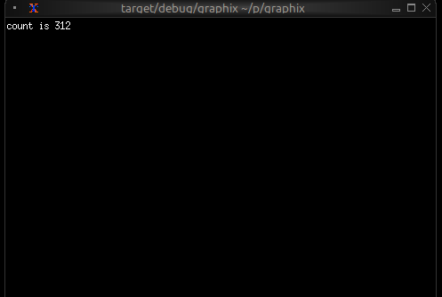

# The Graphix Shell

The Graphix shell (`graphix`) is the primary way to interact with Graphix programs. It provides both an interactive REPL for experimentation and a runtime for executing Graphix scripts. This chapter explores the shell's behavior in depth, covering topics like output handling, module resolution, and project structure.

## Running Modes

The shell operates in several distinct modes:

### REPL Mode

When you run `graphix` with no arguments, it starts an interactive Read-Eval-Print Loop:

```bash
graphix
```

In REPL mode:
- Input is read line by line from the user
- Each line is compiled and executed immediately
- Completion is available via the Tab key
- The value and type of output expressions are
    - built into TUIs if they are of type Tui
    - printed to stdout if they are not
- `Ctrl+C` cancels the currently running expression/tui
- `Ctrl+D` exits the shell

REPL mode is designed for interactive exploration. It doesn't enable warnings by default to keep the experience lightweight.

### Script Mode

When you pass a file path, directory path, or netidx url to `graphix`, it runs in script mode:

```bash
graphix ./myprogram.gx
graphix ./myapp # my app is a directory containing a main.gx
graphix netidx:/path/to/my/program
```

In script mode:
- The entire program source is loaded, compiled, and executed
- The value of the last expression is
    - built into a TUI if it is of type Tui
    - printed to stdout as it updates if it is not
- `Ctrl+C` exits the program
- Warnings are enabled by default (unused variables, unhandled errors)

Script mode is for running complete programs. The shell stays running to
handle the reactive graph's ongoing updates.

### Check Mode

Check mode compiles a program but doesn't execute it:

```bash
graphix --check ./myprogram
```

You can pass the same program sources to check mode as you can to script
mode.

This is useful for:
- Verifying syntax and types without running side effects
- Integrating with editors and build tools
- Quick validation during development


## Understanding Output

One of the most important concepts to understand about the shell is its output behavior. Not all expressions produce output, and expressions that do produce output can update multiple times.

### Output vs Non-Output Expressions

The shell only prints values from expressions that are considered "output expressions." The following expression types are **not** considered output and will not print anything:

- **Bindings**: `let x = 42` defines a variable but doesn't output
- **Lambdas**: `|x| x + 1` defines a function but doesn't output
- **Use statements**: `use stdlib::time` imports a module but doesn't output
- **Connect operations**: `x <- y` schedules updates but doesn't output
- **Module definitions**: `mod m { ... }` defines a module but doesn't output
- **Type definitions**: `type Point = {x: f64, y: f64}` defines a type but doesn't output

Everything else **is** considered an output expression:
- Values: `42`, `"hello"`, `true`
- Arithmetic: `2 + 2`
- Function calls: `time::now()`
- Variable references: `x`
- Struct/variant/tuple construction: `{x: 10, y: 20}`
- Blocks with output expressions as their last value

This is why you can type `let x = 42` in the REPL and not see any output - it's a binding, not an output expression.

### Why Programs Keep Running

Graphix programs are reactive dataflow graphs. When you run an expression that produces output, that output can update over time as upstream values change. The shell keeps the program running to display these updates.

For example:

```graphix
let count = 0;
let timer = time::timer(duration:1.s, true);
count <- timer ~ (count + 1);
count
```

The last line `count` is an output expression. Its value changes every second as the timer fires. The shell stays running, printing each new value.

To stop watching the output and return to the REPL prompt, press `Ctrl+C`. In script mode, `Ctrl+C` exits the entire program.

### Non-Terminating Expressions

Most useful Graphix programs don't terminate naturally because they're reactive systems responding to events. The program runs until you explicitly stop it with `Ctrl+C`.

However, some expressions produce a single value and effectively "complete":

```graphix
〉2 + 2
-: i64
4
```

Even though this printed its value immediately, the shell is still waiting for potential updates. Since `2 + 2` can never update, nothing more will happen, but you still need `Ctrl+C` to return to the prompt.

### Script Output Behavior

When you run in script mode only the **last top-level expression** produces output. Consider this file:

```graphix
let x = 10
let y = 20
x + y
print("Hello")
x * y
```

This file has multiple top-level expressions. The first two are
bindings (no output). The third (`x + y`) is an output expression but
not the last. The fourth calls `print` which has side effects but
returns `_` (bottom). The fifth and final expression (`x * y`) is the
output expression that the shell will print.

When you run this file:
- `print("Hello")` will print "Hello" as a side effect
- The shell will print the value of `x * y` (200) as the program output

### Special Output TUIs

When the type of the output expression is a Tui then instead of
printing the expression to stdout the Graphix shell will switch to TUI
mode and will render the output expression as a tui. For example,

```graphix
〉let count = 0
〉count <- time::timer(1, true) ~ count + 1
〉tui::text::text(&"count is [count]")
```

won't print the expression returned by `tui::text::text(&"count is [count]")` to stdout, it will build a tui,



When you type `Ctrl+C` the shell will exit TUI mode and return to the
normal shell mode. You can use this behavior to experiment with TUI
widgets interactively.

## Module Resolution

A crucial feature of the shell is its automatic module path configuration. Understanding how this works is essential for organizing larger projects.

### Running a Local File

When you run a local file, the **parent directory of that file** is automatically added to the module search path:

```bash
graphix /home/user/myproject/src/main.gx
```

This automatically adds `/home/user/myproject/src` to the module path. Any `.gx` files in that directory can be loaded as modules.

For example, if you have:
```
/home/user/myproject/src/
  main.gx
  utils.gx
  math.gx
```

Then `main.gx` can use:
```graphix
mod utils;
mod math;

utils::helper()
```

The shell will find `utils.gx` and `math.gx` because they're in the same directory.

### Running a Local Directory

When you run a local directory, the shell looks for `main.gx` in that directory and executes it. The directory is also added to the module search path.

For example, with this structure:
```
/home/user/myproject/src/
  main.gx
  utils.gx
  math.gx
```

You can run:
```bash
graphix /home/user/myproject/src
```

This executes `main.gx` and adds `/home/user/myproject/src` to the module search path, so `main.gx` can load `utils` and `math` modules.

This is useful for organizing projects where you want both a runnable program (`main.gx`) and a library interface (`mod.gx`) for the same set of modules.

### Running from Netidx

When you run a program from netidx, the **netidx path** is added to the module search path.

If you run:
```bash
graphix netidx:/my/graphix/modules/myprogram
```

The shell:
1. subscribes to `/my/graphix/modules/myprogram`
2. Loads and executes it
3. Adds `netidx:/my/graphix/modules/myprogram` to the module search path

So if `myprogram` contains `mod utils`, the shell will look for
`netidx:/my/graphix/modules/myprogram/utils`.

### Module Search Path Priority

The complete module search path, in order of priority:

1. **File parent directory** (if running a local file)
2. **Netidx path** (if running from netidx)
3. **GRAPHIX_MODPATH** entries (from the environment variable)
4. **Platform-specific init directory**:
   - Linux: `~/.local/share/graphix`
   - Windows: `%APPDATA%\Roaming\graphix`
   - macOS: `~/Library/Application Support/graphix`

The shell searches these paths in order, returning the first match found.

### The GRAPHIX_MODPATH Environment Variable

You can extend the module search path by setting `GRAPHIX_MODPATH`:

```bash
export GRAPHIX_MODPATH=netidx:/shared/modules,/home/user/graphix-lib
graphix myprogram.gx
```

The syntax is a comma-separated list of paths:
- Paths starting with `netidx:` are netidx paths
- Other paths are treated as filesystem paths
- Escape literal commas in paths with `\`

Example:
```bash
GRAPHIX_MODPATH=netidx:/foo,/home/user/lib,/path/with\,comma
```

This adds:
- `netidx:/foo`
- `/home/user/lib`
- `/path/with,comma`

## Structuring Larger Projects

Understanding module resolution makes it straightforward to structure larger projects.

### Single-Directory Projects

For small to medium projects, keep all `.gx` files in a single directory:

```
myproject/
  main.gx
  ui.gx
  logic.gx
  utils.gx
```

Run with:
```bash
graphix myproject/main.gx
```

The module resolution will automatically find the other `.gx` files in `myproject/`.

### Hierarchical Projects

For larger projects, use directory hierarchies:

```
myproject/
  main.gx
  ui/
    mod.gx
    widgets.gx
    layout.gx
  logic/
    mod.gx
    handlers.gx
    state.gx
```

In this structure:
- `ui/mod.gx` defines the `ui` module (loads submodules)
- `ui/widgets.gx` defines the `ui::widgets` module
- `logic/mod.gx` defines the `logic` module
- `logic/handlers.gx` defines the `logic::handlers` module

From `main.gx`:
```graphix
mod ui;
mod logic;

ui::widgets::button("Click me")
```

The shell will:
1. Find `ui/mod.gx` for the `ui` module
2. Find `ui/widgets.gx` when `ui/mod.gx` does `mod widgets`
3. Similarly for the `logic` hierarchy

### Shared Libraries

To share code across multiple projects, use the init directory or `GRAPHIX_MODPATH`:

**Option 1: Init Directory**

Place shared modules in your platform's init directory (e.g., `~/.local/share/graphix` on Linux):

```
~/.local/share/graphix/
  common.gx
  mylib.gx
```

Any Graphix program can then use:
```graphix
mod common;
mod mylib;
```

**Option 2: GRAPHIX_MODPATH**

Keep shared libraries elsewhere and point to them:

```bash
export GRAPHIX_MODPATH=/opt/graphix-libs
graphix myproject/main.gx
```

**Option 3: Netidx**

Publish shared modules to netidx for organization-wide sharing:

```bash
# Publish the library
netidx publisher /shared/graphix/mylib < mylib.gx

# Use it from any program
GRAPHIX_MODPATH=netidx:/shared/graphix graphix myprogram.gx
```

### The Init Module

In REPL mode only, the shell automatically tries to load a module named `init`. If found, it's loaded before the REPL starts. If not found, the shell continues silently.

Create an `init.gx` file in your init directory to:
- Define commonly used utilities
- Set up default imports

Example `~/.local/share/graphix/init.gx`:
```graphix
// Commonly used stdlib modules
use time;
use str;
use array;

// Personal utilities
let debug = |x| { print("DEBUG: [x]"); x };
let clear = || print("\x1b[2J\x1b[H");
```

Now these are available immediately in any REPL session.

## Command-Line Options

The `graphix` command supports several options for controlling its behavior.

### Netidx Configuration

```bash
# Use a specific netidx config file
graphix --config /path/to/netidx.toml myprogram

# Specify the netidx authentication mechanism
graphix --auth krb5 netidx:/apps/myprogram

# Disable netidx entirely (internal-only mode)
graphix --no-netidx ./myapp
```

When netidx is disabled, networking functions work only within the same process.

### Publisher Configuration

```bash
# Set the publisher bind address
graphix --bind 127.0.0.1:5000 ./myprogram.gx

# Set a timeout for slow subscribers
graphix --publish-timeout 30 myprogram
```

### Module Resolution

```bash
# Set timeout for resolving netidx modules (seconds)
graphix --resolve-timeout 10 netidx:/apps/myprogram

# Skip loading the init module in REPL mode
graphix --no-init
```

### Compiler Warnings

Control which warnings are enabled with the `-W` flag:

```bash
# Warn about unhandled error operators (?) - default in script mode
graphix -W unhandled ./myprogram

# Disable warning about unhandled errors
graphix -W no-unhandled myapp.gx

# Warn about unhandled arithmetic overflow
graphix -W unhandled-arith netidx:/apps/calculator

# Warn about unused variables - default in script mode
graphix -W unused ./myproject

# Disable unused variable warnings
graphix -W no-unused myprogram.gx

# Make all warnings into errors
graphix -W error ./myapp
```

Multiple warning flags can be combined:
```bash
graphix -W unused -W unhandled -W error myprogram
```

If you specify both a flag and its negation (e.g., `unhandled` and `no-unhandled`), the `no-` variant always wins.

### Logging

Enable debug logging for troubleshooting:

```bash
RUST_LOG=debug graphix --log-dir /tmp/graphix-logs ./myprogram
```

Logs will be written to files in the specified directory.

## Summary

The Graphix shell is designed around the reactive nature of Graphix programs:

- **Output expressions** produce values that can update over time
- **Programs keep running** to display ongoing updates
- **Ctrl+C** stops the current expression (REPL) or exits (file mode)
- **Module resolution** is automatic based on where you run from
- **Project structure** can be flat or hierarchical
- **Shared code** can live in the init directory, GRAPHIX_MODPATH, or netidx

Understanding these concepts will help you work efficiently with Graphix, whether you're experimenting in the REPL or building large applications.
