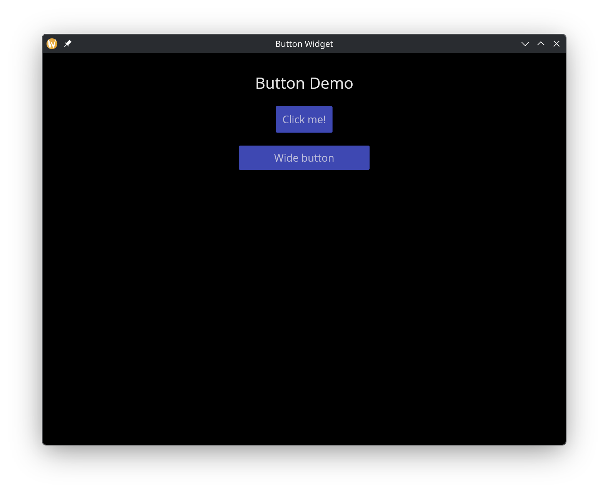

# The Button Widget

A clickable button that wraps a child widget (typically text). Buttons trigger a callback when pressed and can be styled with custom width, height, and padding.

## Interface

```graphix
val button: fn(
  ?#on_press: fn(null) -> Any,
  ?#width: &Length,
  ?#height: &Length,
  ?#padding: &Padding,
  ?#disabled: &bool,
  &Widget
) -> Widget
```

## Parameters

- **`#on_press`** -- Callback invoked when the button is clicked. Receives `null` as its argument. Use the sample operator `~` inside the callback to capture current state at click time: `|c| counter <- c ~ counter + 1`. If omitted, the button renders but does nothing when clicked.
- **`#width`** -- Width of the button. Accepts `Length` values: `` `Fill ``, `` `Shrink ``, or `` `Fixed(f64) ``. Defaults to `` `Shrink ``.
- **`#height`** -- Height of the button. Same `Length` values as width. Defaults to `` `Shrink ``.
- **`#padding`** -- Interior padding around the child widget. Accepts `Padding` values: `` `All(f64) ``, `` `Axis({x: f64, y: f64}) ``, or `` `Each({top: f64, right: f64, bottom: f64, left: f64}) ``.
- **`#disabled`** -- When `true`, the button is grayed out and `#on_press` is not triggered. Defaults to `false`.
- **positional `&Widget`** -- The child widget displayed inside the button. Usually a `text` widget.

## Examples

### Basic Buttons

```graphix
{{#include ../../examples/gui/button.gx}}
```



## See Also

- [text](text.md) -- the most common child widget for buttons
- [mouse_area](mouse_area.md) -- for click detection on arbitrary widgets
