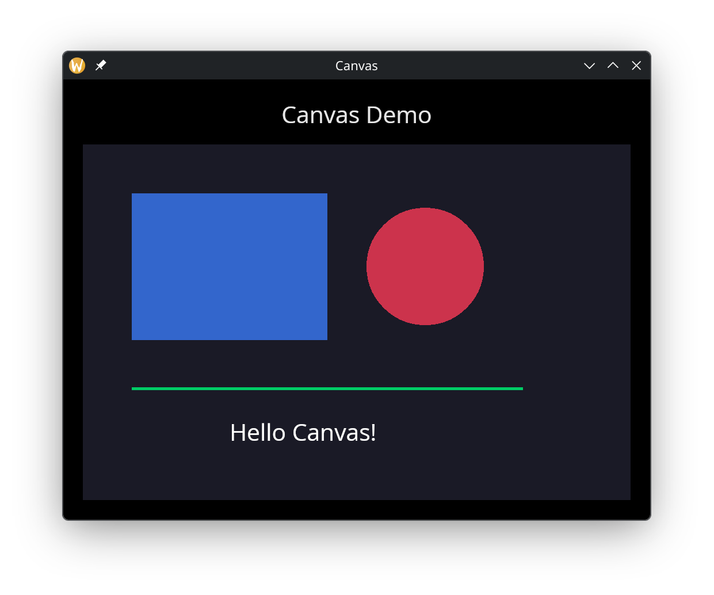

# The Canvas Widget

The `canvas` widget provides a low-level 2D drawing surface for custom graphics. You supply an array of shapes -- lines, circles, rectangles, arcs, curves, text labels, and arbitrary paths -- and the canvas renders them in order. This makes it suitable for diagrams, visualizations, procedural art, and anything that doesn't fit into the standard widget set.

## Interface

```graphix
type PathSegment = [
  `MoveTo({x: f64, y: f64}),
  `LineTo({x: f64, y: f64}),
  `BezierTo({
    control_a: {x: f64, y: f64},
    control_b: {x: f64, y: f64},
    to: {x: f64, y: f64}
  }),
  `QuadraticTo({
    control: {x: f64, y: f64},
    to: {x: f64, y: f64}
  }),
  `ArcTo({
    a: {x: f64, y: f64},
    b: {x: f64, y: f64},
    radius: f64
  }),
  `Close(null)
];

type CanvasShape = [
  `Line({
    from: {x: f64, y: f64}, to: {x: f64, y: f64},
    color: Color, width: f64
  }),
  `Circle({
    center: {x: f64, y: f64}, radius: f64,
    fill: [Color, null], stroke: [{color: Color, width: f64}, null]
  }),
  `Rect({
    top_left: {x: f64, y: f64}, size: {width: f64, height: f64},
    fill: [Color, null], stroke: [{color: Color, width: f64}, null]
  }),
  `RoundedRect({
    top_left: {x: f64, y: f64}, size: {width: f64, height: f64},
    radius: f64,
    fill: [Color, null], stroke: [{color: Color, width: f64}, null]
  }),
  `Arc({
    center: {x: f64, y: f64}, radius: f64,
    start_angle: f64, end_angle: f64,
    stroke: {color: Color, width: f64}
  }),
  `Ellipse({
    center: {x: f64, y: f64}, radii: {x: f64, y: f64},
    rotation: f64, start_angle: f64, end_angle: f64,
    fill: [Color, null], stroke: [{color: Color, width: f64}, null]
  }),
  `BezierCurve({
    from: {x: f64, y: f64},
    control_a: {x: f64, y: f64}, control_b: {x: f64, y: f64},
    to: {x: f64, y: f64},
    color: Color, width: f64
  }),
  `QuadraticCurve({
    from: {x: f64, y: f64}, control: {x: f64, y: f64},
    to: {x: f64, y: f64},
    color: Color, width: f64
  }),
  `Text({
    content: string, position: {x: f64, y: f64},
    color: Color, size: f64
  }),
  `Path({
    segments: Array<PathSegment>,
    fill: [Color, null], stroke: [{color: Color, width: f64}, null]
  })
];

val canvas: fn(
  ?#width: &Length,
  ?#height: &Length,
  ?#background: &[Color, null],
  &Array<CanvasShape>
) -> Widget
```

## Parameters

- **width** - Horizontal sizing as a `Length`. Defaults to `` `Shrink ``.
- **height** - Vertical sizing as a `Length`. Defaults to `` `Shrink ``.
- **background** - Background color for the canvas area. Null means transparent.

The positional argument is a reference to an array of `CanvasShape` values. Shapes are drawn in array order, so later shapes paint over earlier ones.

## Shapes

### Line

A straight line between two points with a given color and stroke width.

```graphix
`Line({ from: {x: 0.0, y: 0.0}, to: {x: 100.0, y: 50.0},
        color: color(#r: 1.0)$, width: 2.0 })
```

### Circle

A circle defined by center and radius. Either or both of `fill` and `stroke` can be provided; set the other to null.

```graphix
`Circle({ center: {x: 100.0, y: 100.0}, radius: 40.0,
          fill: color(#r: 0.2, #g: 0.6, #b: 1.0)$, stroke: null })
```

### Rect

An axis-aligned rectangle defined by its top-left corner and size.

```graphix
`Rect({ top_left: {x: 10.0, y: 10.0}, size: {width: 80.0, height: 60.0},
        fill: color(#g: 0.8, #b: 0.4)$, stroke: null })
```

### RoundedRect

Like `Rect` but with rounded corners. The `radius` field controls the corner rounding.

```graphix
`RoundedRect({ top_left: {x: 10.0, y: 10.0}, size: {width: 80.0, height: 60.0},
               radius: 8.0,
               fill: null, stroke: {color: color(#r: 1.0, #g: 1.0, #b: 1.0)$, width: 2.0} })
```

### Arc

A circular arc defined by center, radius, and start/end angles in radians. Arcs only have a stroke (no fill).

```graphix
`Arc({ center: {x: 100.0, y: 100.0}, radius: 50.0,
       start_angle: 0.0, end_angle: 3.14159,
       stroke: {color: color(#r: 1.0, #g: 0.5)$, width: 2.0} })
```

### Ellipse

An ellipse with independent x and y radii, a rotation angle, and start/end angles (all in radians). Supports both fill and stroke.

```graphix
`Ellipse({ center: {x: 150.0, y: 100.0}, radii: {x: 60.0, y: 30.0},
           rotation: 0.5, start_angle: 0.0, end_angle: 6.283,
           fill: color(#r: 0.8, #g: 0.2, #b: 0.8, #a: 0.5)$, stroke: null })
```

### BezierCurve

A cubic Bezier curve defined by start, two control points, and end. Drawn as a stroked line.

```graphix
`BezierCurve({ from: {x: 0.0, y: 100.0},
               control_a: {x: 50.0, y: 0.0}, control_b: {x: 150.0, y: 200.0},
               to: {x: 200.0, y: 100.0},
               color: color(#g: 1.0, #b: 1.0)$, width: 2.0 })
```

### QuadraticCurve

A quadratic Bezier curve with one control point. Drawn as a stroked line.

```graphix
`QuadraticCurve({ from: {x: 0.0, y: 100.0},
                  control: {x: 100.0, y: 0.0},
                  to: {x: 200.0, y: 100.0},
                  color: color(#r: 1.0, #g: 1.0)$, width: 2.0 })
```

### Text

A text label placed at a specific position on the canvas.

```graphix
`Text({ content: "Hello", position: {x: 50.0, y: 50.0},
        color: color(#r: 1.0, #g: 1.0, #b: 1.0)$, size: 16.0 })
```

### Path

An arbitrary path built from `PathSegment` values. Supports fill, stroke, or both. Path segments are:

- `` `MoveTo({x, y}) `` -- move the pen without drawing
- `` `LineTo({x, y}) `` -- draw a straight line to the point
- `` `BezierTo({control_a, control_b, to}) `` -- cubic Bezier segment
- `` `QuadraticTo({control, to}) `` -- quadratic Bezier segment
- `` `ArcTo({a, b, radius}) `` -- arc through two tangent points
- `` `Close(null) `` -- close the path back to its start

```graphix
`Path({
  segments: [
    `MoveTo({x: 0.0, y: 0.0}),
    `LineTo({x: 50.0, y: 100.0}),
    `LineTo({x: 100.0, y: 0.0}),
    `Close(null)
  ],
  fill: color(#r: 0.5, #b: 0.5, #a: 0.8)$,
  stroke: null
})
```

## Examples

### Basic Shapes

```graphix
{{#include ../../examples/gui/canvas.gx}}
```



## See Also

- [chart](chart.md) - Pre-built chart widget for data visualization
- [image](image.md) - Display raster images and SVGs
