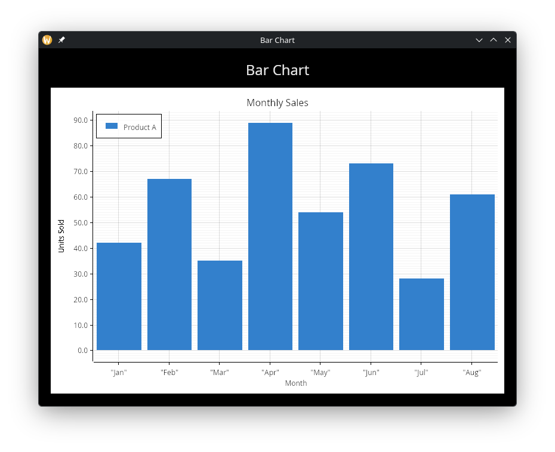
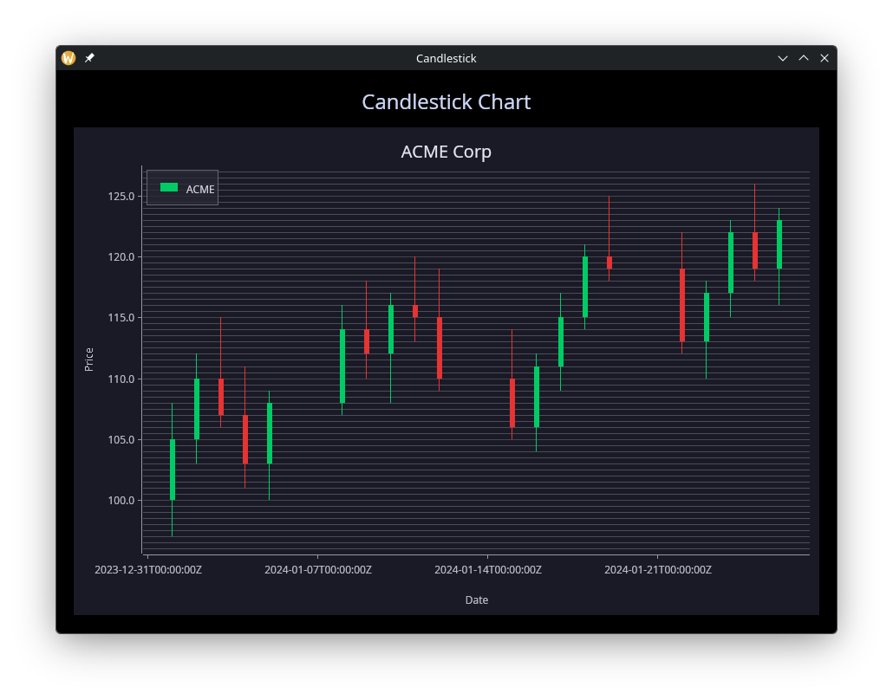
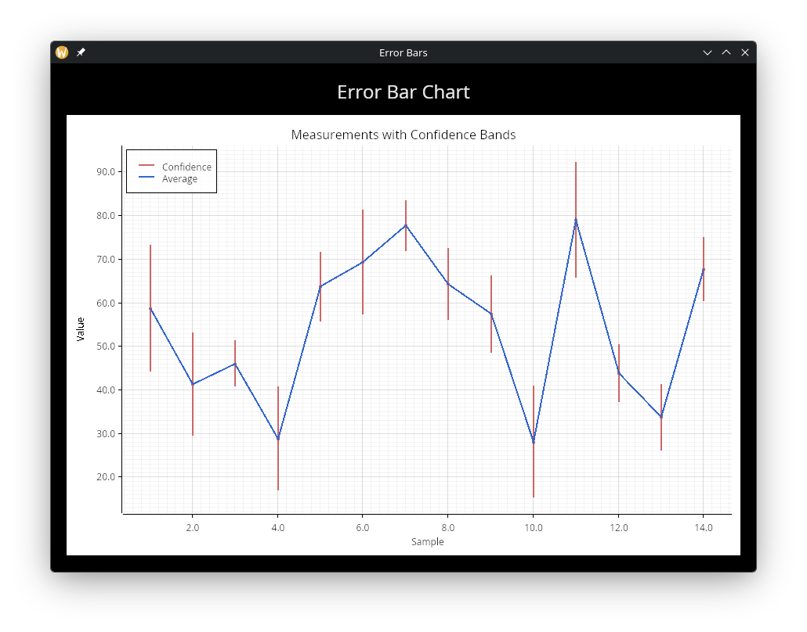
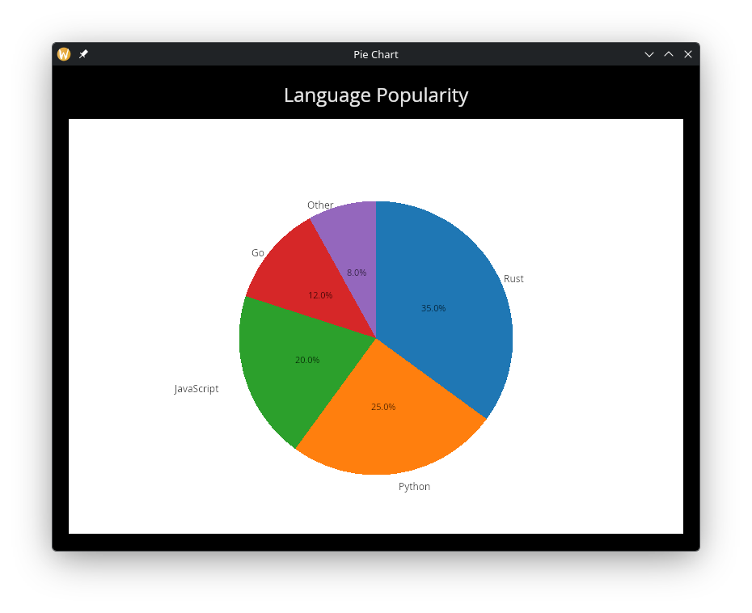
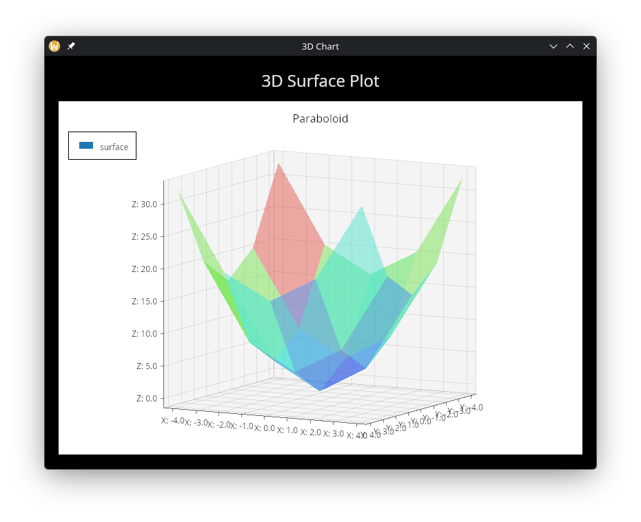
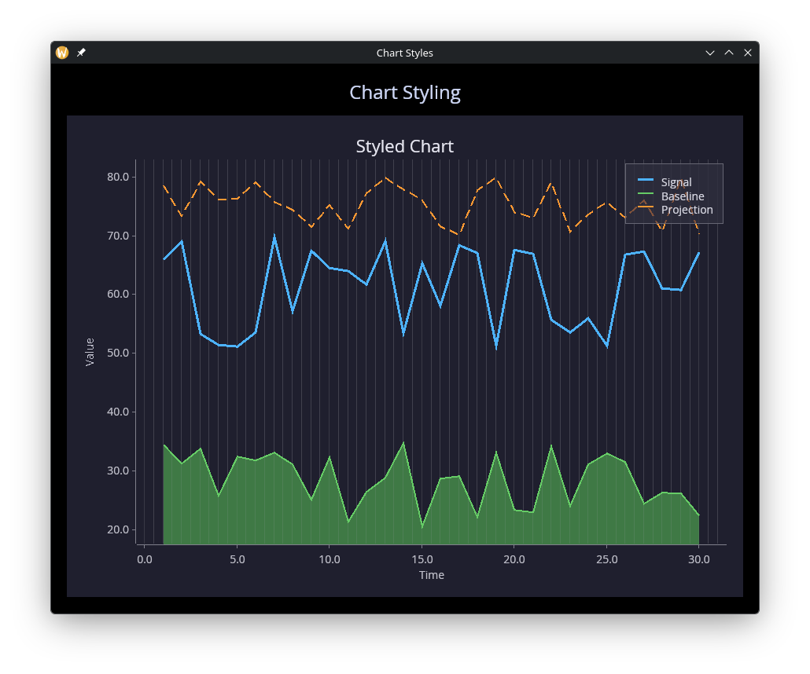

# The Chart Widget

The `chart` widget renders data visualizations with multiple datasets, axis labels, and automatic or manual axis scaling. It supports line charts, scatter plots, bar charts, area charts, dashed lines, candlestick charts, error bars, pie charts, and 3D plots (scatter, line, surface). Multiple series types can be mixed on the same chart (within the same mode — you cannot mix e.g. bar and pie).

## Interface

```graphix
type SeriesStyle = {
  color: [Color, null],
  label: [string, null],
  stroke_width: [f64, null],
  point_size: [f64, null]
};

type BarStyle = {
  color: [Color, null],
  label: [string, null],
  margin: [f64, null]
};

type CandlestickStyle = {
  gain_color: [Color, null],
  loss_color: [Color, null],
  bar_width: [f64, null],
  label: [string, null]
};

type PieStyle = {
  colors: [Array<Color>, null],
  donut: [f64, null],
  label_offset: [f64, null],
  show_percentages: [bool, null],
  start_angle: [f64, null]
};

type SurfaceStyle = {
  color: [Color, null],
  color_by_z: [bool, null],
  label: [string, null]
};

type Projection3D = {
  pitch: [f64, null],
  scale: [f64, null],
  yaw: [f64, null]
};

type OhlcPoint<'a: [f64, datetime]> = {x: 'a, open: f64, high: f64, low: f64, close: f64};
type ErrorBarPoint<'a: [f64, datetime]> = {x: 'a, min: f64, avg: f64, max: f64};

type MeshStyle = {
  show_x_grid: [bool, null],
  show_y_grid: [bool, null],
  grid_color: [Color, null],
  axis_color: [Color, null],
  label_color: [Color, null],
  label_size: [f64, null],
  x_label_area_size: [f64, null],
  x_labels: [i64, null],
  y_label_area_size: [f64, null],
  y_labels: [i64, null]
};

type LegendStyle = {
  background: [Color, null],
  border: [Color, null],
  label_color: [Color, null],
  label_size: [f64, null]
};

type LegendPosition = [
  `UpperLeft, `UpperRight, `LowerLeft, `LowerRight,
  `MiddleLeft, `MiddleRight, `UpperMiddle, `LowerMiddle
];

type Dataset = [
  `Line({data: &[Array<(f64, f64)>, Array<(datetime, f64)>], style: SeriesStyle}),
  `Scatter({data: &[Array<(f64, f64)>, Array<(datetime, f64)>], style: SeriesStyle}),
  `Bar({data: &Array<(string, f64)>, style: BarStyle}),
  `Area({data: &[Array<(f64, f64)>, Array<(datetime, f64)>], style: SeriesStyle}),
  `DashedLine({data: &[Array<(f64, f64)>, Array<(datetime, f64)>], dash: f64, gap: f64, style: SeriesStyle}),
  `Candlestick({data: &[Array<OhlcPoint<f64>>, Array<OhlcPoint<datetime>>], style: CandlestickStyle}),
  `ErrorBar({data: &[Array<ErrorBarPoint<f64>>, Array<ErrorBarPoint<datetime>>], style: SeriesStyle}),
  `Pie({data: &Array<(string, f64)>, style: PieStyle}),
  `Scatter3D({data: &Array<(f64, f64, f64)>, style: SeriesStyle}),
  `Line3D({data: &Array<(f64, f64, f64)>, style: SeriesStyle}),
  `Surface({data: &Array<Array<(f64, f64, f64)>>, style: SurfaceStyle})
];

val chart: fn(
  ?#title: &[string, null],
  ?#title_color: &[Color, null],
  ?#x_label: &[string, null],
  ?#y_label: &[string, null],
  ?#x_range: &[{min: f64, max: f64}, {min: datetime, max: datetime}, null],
  ?#y_range: &[{min: f64, max: f64}, null],
  ?#z_label: &[string, null],
  ?#z_range: &[{min: f64, max: f64}, null],
  ?#projection: &[Projection3D, null],
  ?#width: &Length,
  ?#height: &Length,
  ?#background: &[Color, null],
  ?#margin: &[f64, null],
  ?#title_size: &[f64, null],
  ?#legend_position: &[LegendPosition, null],
  ?#legend_style: &[LegendStyle, null],
  ?#mesh: &[MeshStyle, null],
  &Array<Dataset>
) -> Widget
```

## Chart Parameters

- **title** — Chart title displayed above the plot area. Null for no title.
- **title_color** — Color of the chart title text. Defaults to black when null.
- **x_label** — Label for the x-axis. Null for no label.
- **y_label** — Label for the y-axis. Null for no label.
- **x_range** — Manual x-axis range as `{min: f64, max: f64}` or `{min: datetime, max: datetime}`. When null, the range is computed automatically from the data.
- **y_range** — Manual y-axis range as `{min: f64, max: f64}`. When null, auto-computed.
- **z_label** — Label for the z-axis (3D charts only). Null for no label.
- **z_range** — Manual z-axis range as `{min: f64, max: f64}` (3D charts only). When null, auto-computed.
- **projection** — 3D projection parameters as a `Projection3D` struct. Controls pitch, yaw, and scale of the 3D view. When null, plotters defaults are used.
- **width** — Horizontal sizing as a `Length`. Defaults to `` `Fill ``.
- **height** — Vertical sizing as a `Length`. Defaults to `` `Fill ``.
- **background** — Background color as a `Color` struct. Defaults to white when null.
- **margin** — Margin in pixels around the plot area. Defaults to 10.
- **title_size** — Font size for the chart title. Defaults to 16.
- **legend_position** — Position of the series legend. Defaults to `` `UpperLeft `` when null.
- **legend_style** — Legend appearance via a `LegendStyle` struct. Controls background, border, text color, and label size. When null, defaults to white background with black border.
- **mesh** — Grid and axis styling via a `MeshStyle` struct. When null, plotters defaults are used.

The positional argument is a reference to an array of `Dataset` values. Multiple datasets can be plotted on the same axes.

## Series Constructors

Rather than constructing `Dataset` variants directly, use these convenience functions. All style parameters are optional and default to null.

### `chart::line`

```graphix
chart::line(#label: "Price", #color: color(#r: 1.0)$, &data)
```

Points connected by straight line segments. Data is `&[Array<(f64, f64)>, Array<(datetime, f64)>]` — either numeric or time-series x values.

### `chart::scatter`

```graphix
chart::scatter(#label: "Points", #point_size: 5.0, &data)
```

Individual points without connecting lines. Same data type as line.

### `chart::bar`

```graphix
chart::bar(#label: "Counts", &data)
```

Vertical bars from the x-axis. Data is `&Array<(string, f64)>` — category labels paired with values. Uses `BarStyle` (which has `margin` instead of `stroke_width`/`point_size`).

### `chart::area`

```graphix
chart::area(#label: "Volume", &data)
```

Like line but with the region between the line and the x-axis filled with 30% opacity. Same data type as line.

### `chart::dashed_line`

```graphix
chart::dashed_line(#label: "Projection", #dash: 10.0, #gap: 5.0, &data)
```

A dashed line series. `dash` and `gap` control the dash and gap lengths in pixels. Defaults to 5.0 each.

### `chart::candlestick`

```graphix
chart::candlestick(#label: "OHLC", &ohlc_data)
```

Financial candlestick chart. Data is `&[Array<OhlcPoint<f64>>, Array<OhlcPoint<datetime>>]` where each point has `{x, open, high, low, close}` fields. Gain candles (close > open) are green by default; loss candles are red. Override with `#gain_color` and `#loss_color`.

### `chart::error_bar`

```graphix
chart::error_bar(#label: "Confidence", &error_data)
```

Vertical error bars. Data is `&[Array<ErrorBarPoint<f64>>, Array<ErrorBarPoint<datetime>>]` where each point has `{x, min, avg, max}` fields. A circle is drawn at the average value with whiskers extending to min and max.

### `chart::pie`

```graphix
chart::pie(#show_percentages: true, #start_angle: -90.0, &data)
```

Pie chart. Data is `&Array<(string, f64)>` — category labels paired with values. Uses `PieStyle` which controls colors, donut hole size, label offset, percentage display, and start angle.

### `chart::scatter3d`

```graphix
chart::scatter3d(#label: "3D Points", #point_size: 4.0, &data)
```

3D scatter plot. Data is `&Array<(f64, f64, f64)>`. Use the chart `#projection` parameter to control the 3D viewing angle.

### `chart::line3d`

```graphix
chart::line3d(#label: "3D Line", &data)
```

3D line plot. Data is `&Array<(f64, f64, f64)>`. Points connected by line segments in 3D space.

### `chart::surface`

```graphix
chart::surface(#color_by_z: true, #label: "surface", &grid_data)
```

3D surface plot. Data is `&Array<Array<(f64, f64, f64)>>` — a grid of rows where each point is `(x, y, z)`. Set `#color_by_z: true` for automatic heat-map coloring based on z values.

### `chart::mesh_style`

```graphix
chart::mesh_style(#label_color: color(#r: 1.0, #g: 1.0, #b: 1.0)$, #x_labels: 5)
```

Constructs a `MeshStyle` value for use with the chart's `#mesh` parameter.

### `chart::legend_style`

```graphix
chart::legend_style(#background: color(#r: 0.1, #g: 0.1, #b: 0.1)$, #label_color: color(#r: 1.0, #g: 1.0, #b: 1.0)$)
```

Constructs a `LegendStyle` value for use with the chart's `#legend_style` parameter.

## Style Fields

### SeriesStyle

Used by line, scatter, area, dashed_line, error_bar, scatter3d, and line3d:

- **color** — Series color. When null, a color is assigned from a default palette.
- **label** — Display name shown in the legend. When null, no legend entry is created.
- **stroke_width** — Line/stroke width in pixels. Defaults to 2.
- **point_size** — Point radius for scatter plots. Defaults to 3.

### BarStyle

Used by bar:

- **color** — Bar fill color. When null, assigned from palette.
- **label** — Display name shown in the legend.
- **margin** — Margin between bars in pixels.

### CandlestickStyle

Used by candlestick:

- **gain_color** — Color for gain candles (close > open). Defaults to green.
- **loss_color** — Color for loss candles (close <= open). Defaults to red.
- **bar_width** — Width of candlestick bodies in pixels. Defaults to 5.
- **label** — Display name shown in the legend.

### PieStyle

Used by pie:

- **colors** — Array of colors for pie slices. When null, default palette is used.
- **donut** — Inner radius as a fraction of the outer radius (0.0–1.0). When null or 0, draws a full pie.
- **label_offset** — Distance of labels from the pie center as a percentage. Defaults to plotters default.
- **show_percentages** — Whether to display percentage values on labels. Defaults to false.
- **start_angle** — Starting angle in degrees. Defaults to 0 (3 o'clock position). Use -90.0 to start at 12 o'clock.

### SurfaceStyle

Used by surface:

- **color** — Surface fill color. When null, assigned from palette.
- **color_by_z** — When true, colors the surface with a heat map based on z values. Defaults to false.
- **label** — Display name shown in the legend.

### Projection3D

Used with the chart `#projection` parameter for 3D charts:

- **pitch** — Vertical rotation angle in radians.
- **scale** — Scale factor for the 3D projection.
- **yaw** — Horizontal rotation angle in radians.

## MeshStyle Fields

- **show_x_grid** — Show vertical grid lines. Defaults to true when null.
- **show_y_grid** — Show horizontal grid lines. Defaults to true when null.
- **grid_color** — Color of grid lines.
- **axis_color** — Color of axis lines.
- **label_color** — Color of tick labels and axis descriptions. Essential for dark backgrounds where the default black text is invisible.
- **label_size** — Font size for axis labels.
- **x_label_area_size** — Width of the x-axis label area in pixels. Increase to prevent label clipping.
- **x_labels** — Number of x-axis tick labels.
- **y_label_area_size** — Width of the y-axis label area in pixels. Increase to prevent label clipping.
- **y_labels** — Number of y-axis tick labels.

## LegendStyle Fields

- **background** — Legend background color. Defaults to white when null.
- **border** — Legend border color. Defaults to black when null.
- **label_color** — Color of legend text labels. Defaults to plotters default (black) when null.
- **label_size** — Font size for legend labels. When null, plotters default is used.

## Examples

### Multiple Datasets

```graphix
{{#include ../../examples/gui/chart.gx}}
```


### Bar Chart

```graphix
{{#include ../../examples/gui/chart_bar.gx}}
```



### Candlestick

```graphix
{{#include ../../examples/gui/chart_candlestick.gx}}
```




### Error Bars

```graphix
{{#include ../../examples/gui/chart_error_bar.gx}}
```



### Pie Chart

```graphix
{{#include ../../examples/gui/chart_pie.gx}}
```



### 3D Surface

```graphix
{{#include ../../examples/gui/chart_3d.gx}}
```



### Styling

```graphix
{{#include ../../examples/gui/chart_styles.gx}}
```



## See Also

- [canvas](canvas.md) — Low-level drawing for custom visualizations
