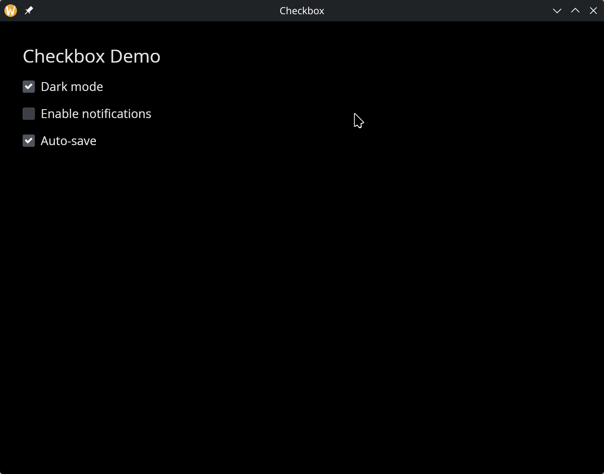

# The Checkbox Widget

A checkbox with an optional text label. Displays a checked or unchecked box and reports toggles through a callback. Useful for boolean settings and multi-select scenarios.

## Interface

```graphix
val checkbox: fn(
  ?#label: &string,
  ?#on_toggle: fn(bool) -> Any,
  ?#width: &Length,
  ?#size: &[f64, null],
  ?#spacing: &[f64, null],
  ?#disabled: &bool,
  &bool
) -> Widget
```

## Parameters

- **`#label`** -- Text displayed next to the checkbox. If omitted, the checkbox renders without a label.
- **`#on_toggle`** -- Callback invoked when the checkbox is clicked. Receives the new boolean state (`true` if now checked, `false` if unchecked). Typically: `#on_toggle: |v| checked <- v`.
- **`#width`** -- Width of the widget (checkbox plus label). Accepts `Length` values.
- **`#size`** -- Size of the checkbox square in pixels, or `null` for the default size.
- **`#spacing`** -- Gap in pixels between the checkbox and the label text, or `null` for the default spacing.
- **`#disabled`** -- When `true`, the checkbox is grayed out and cannot be toggled. Defaults to `false`.
- **positional `&bool`** -- Reference to the checked state. `true` renders a checked box, `false` renders unchecked.

## Examples

### Checkbox Group

```graphix
{{#include ../../examples/gui/checkbox.gx}}
```



## See Also

- [toggler](toggler.md) -- a toggle switch with the same interface
- [radio](radio.md) -- for single-select from a group of options
