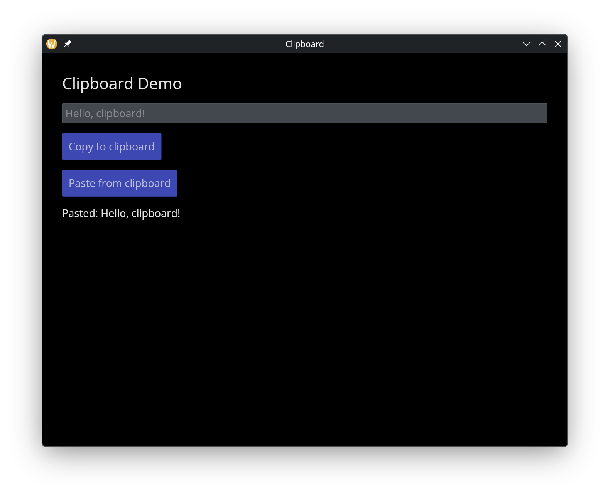

# The Clipboard Module

The `clipboard` module provides functions for reading from and writing to the system clipboard. Unlike other GUI components, clipboard is a plain module of functions, not a widget constructor.

## Interface

```graphix
type ClipboardImage = { height: u32, pixels: bytes, width: u32 };
type HtmlContent = { alt_text: string, html: string };

val read_text:   fn(Any) -> Result<string, `ClipboardError(string)>;
val write_text:  fn(string) -> Result<null, `ClipboardError(string)>;
val read_image:  fn(Any) -> Result<ClipboardImage, `ClipboardError(string)>;
val write_image: fn(ClipboardImage) -> Result<null, `ClipboardError(string)>;
val read_html:   fn(Any) -> Result<string, `ClipboardError(string)>;
val write_html:  fn(HtmlContent) -> Result<null, `ClipboardError(string)>;
val read_files:  fn(Any) -> Result<Array<string>, `ClipboardError(string)>;
val write_files: fn(Array<string>) -> Result<null, `ClipboardError(string)>;
val clear:       fn(Any) -> Result<null, `ClipboardError(string)>;
```

## Functions

### Text
- **read_text** — reads text from the clipboard. Takes an event trigger (`Any`) to control when the read happens.
- **write_text** — writes a string to the clipboard.

### Images
- **read_image** — reads an image from the clipboard as a `ClipboardImage` containing raw pixel data.
- **write_image** — writes a `ClipboardImage` to the clipboard.

### HTML
- **read_html** — reads HTML content from the clipboard.
- **write_html** — writes HTML content with alt text to the clipboard.

### Files
- **read_files** — reads file paths from the clipboard (e.g. from a file manager copy).
- **write_files** — writes file paths to the clipboard.

### Utility
- **clear** — clears all clipboard contents.

All read functions take an `Any` argument as an event trigger — they execute when the trigger fires. All functions return `Result` types that may contain a `ClipboardError`.

## Examples

```graphix
{{#include ../../examples/gui/clipboard.gx}}
```



## See Also

- [Button](button.md) — commonly used to trigger clipboard operations
- [Text Input](text_input.md) — text entry for clipboard content
