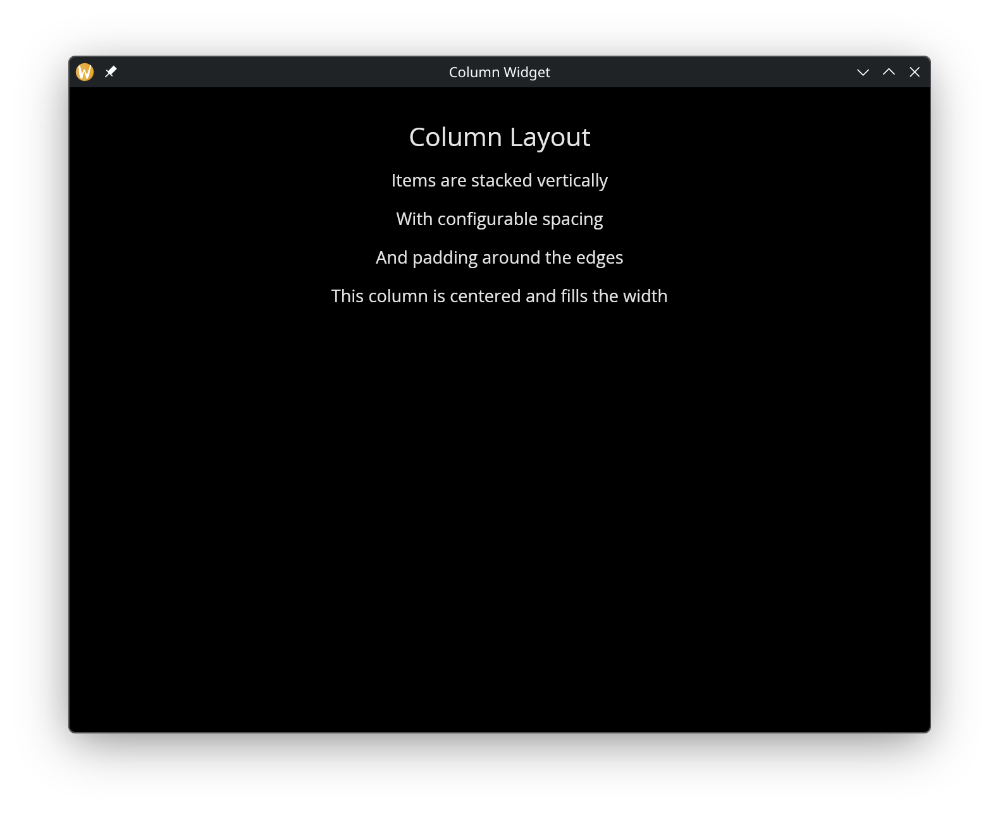

# The Column Widget

The `column` widget arranges child widgets vertically from top to bottom. It is one of the primary layout containers, along with `row`.

## Interface

```graphix
val column: fn(
  ?#spacing: &f64,
  ?#padding: &Padding,
  ?#width: &Length,
  ?#height: &Length,
  ?#halign: &HAlign,
  &Array<Widget>
) -> Widget
```

## Parameters

- **spacing** — vertical space between child widgets in pixels
- **padding** — space around the column's edges (see [Types](types.md) for `Padding` variants)
- **width** — column width (`Fill`, `Shrink`, `Fixed(px)`, or `FillPortion(n)`)
- **height** — column height
- **halign** — horizontal alignment of children within the column (`Left`, `Center`, `Right`)

The positional argument is a reference to an array of child widgets.

## Examples

```graphix
{{#include ../../examples/gui/column.gx}}
```



## See Also

- [Row](row.md) — horizontal layout
- [Container](container.md) — single-child alignment and padding
- [Stack](stack.md) — overlapping layout
- [Space & Rules](space.md) — spacing and dividers within layouts
