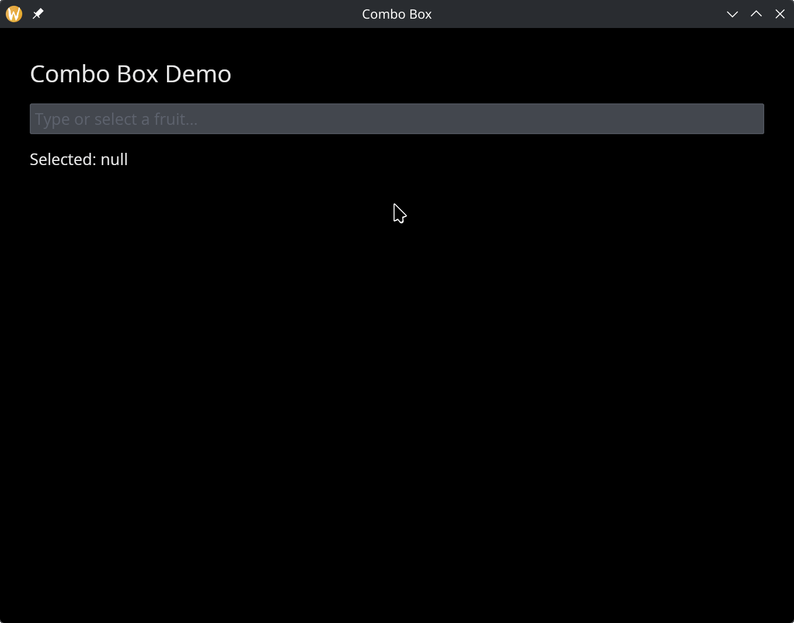

# The Combo Box Widget

A searchable dropdown that combines a text input with a dropdown list. As the user types, the options are filtered to match. This is useful when the list of options is long and the user needs to find a specific item quickly.

## Interface

```graphix
val combo_box: fn(
  ?#selected: &[string, null],
  ?#on_select: fn(string) -> Any,
  ?#placeholder: &string,
  ?#width: &Length,
  ?#disabled: &bool,
  &Array<string>
) -> Widget
```

## Parameters

- **`#selected`** -- Reference to the currently selected value, or `null` if nothing is selected.
- **`#on_select`** -- Callback invoked when the user selects an item from the filtered list. Receives the selected string.
- **`#placeholder`** -- Placeholder text shown in the input field when nothing is selected. Defaults to `"Type to search..."`.
- **`#width`** -- Width of the widget. Accepts `Length` values.
- **`#disabled`** -- When `true`, the combo box cannot be interacted with. Defaults to `false`.
- **positional `&Array<string>`** -- Reference to the full list of options. The combo box filters this list as the user types.

## Examples

```graphix
{{#include ../../examples/gui/combo_box.gx}}
```



## See Also

- [Pick List](pick_list.md) — standard dropdown without search
- [Radio](radio.md) — inline single-select when there are few options
