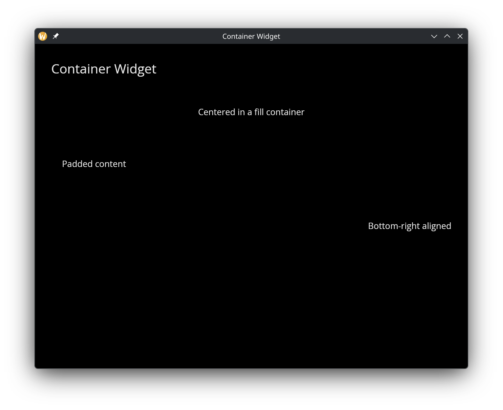

# The Container Widget

The `container` widget wraps a single child widget, providing padding and alignment control. Use it to position content within a fixed or flexible region.

## Interface

```graphix
val container: fn(
  ?#padding: &Padding,
  ?#width: &Length,
  ?#height: &Length,
  ?#halign: &HAlign,
  ?#valign: &VAlign,
  &Widget
) -> Widget
```

## Parameters

- **padding** — space between the container's edges and its child
- **width** — container width (`Fill`, `Shrink`, `Fixed(px)`, or `FillPortion(n)`)
- **height** — container height
- **halign** — horizontal alignment of the child (`Left`, `Center`, `Right`)
- **valign** — vertical alignment of the child (`Top`, `Center`, `Bottom`)

The positional argument is a reference to the child widget.

## Examples

```graphix
{{#include ../../examples/gui/container.gx}}
```



## See Also

- [Column](column.md) — vertical multi-child layout
- [Row](row.md) — horizontal multi-child layout
- [Stack](stack.md) — overlapping layout
