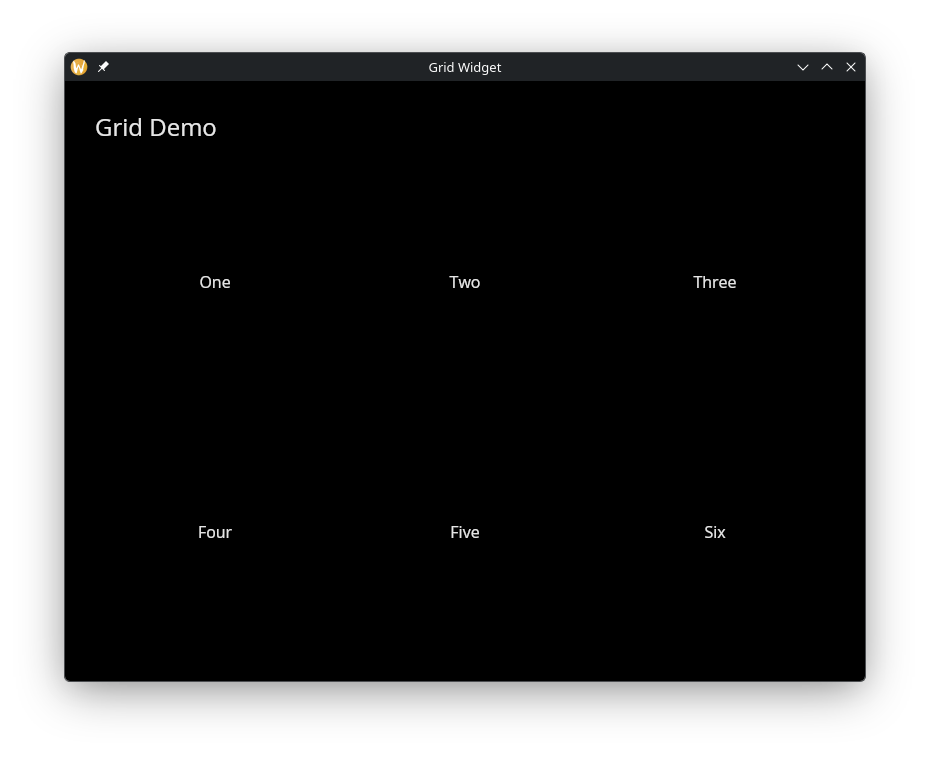

# The Grid Widget

A layout container that arranges child widgets in a grid with a fixed number of columns. Items wrap to the next row automatically.

## Interface

```graphix
type GridColumns = [`Fixed(i64), `Fluid(f64)];
type GridHeight = [`AspectRatio(f64), `EvenlyDistribute(Length)];

val grid: fn(
  ?#spacing: &f64,
  ?#columns: &GridColumns,
  ?#width: &[f64, null],
  ?#height: &GridHeight,
  &Array<Widget>
) -> Widget
```

## Parameters

- **`#spacing`** -- Space in pixels between grid cells, applied both horizontally and vertically. Defaults to `0.0`.
- **`#columns`** -- How columns are determined. `` `Fixed(n) `` uses exactly `n` columns. `` `Fluid(min_width) `` calculates the column count so each column is at least `min_width` pixels wide. Defaults to `` `Fixed(3) ``.
- **`#width`** -- Total width of the grid in pixels, or `null` to use the available space. Defaults to `null`.
- **`#height`** -- How row heights are determined. `` `AspectRatio(ratio) `` sets each cell's height relative to its width (e.g. `1.0` for square cells). `` `EvenlyDistribute(len) `` divides the given `Length` evenly among all rows. Defaults to `` `AspectRatio(1.0) ``.
- **positional `&Array<Widget>`** -- The child widgets to arrange in the grid. They fill left-to-right, top-to-bottom.

## Examples

### Colored Grid Items

```graphix
{{#include ../../examples/gui/grid.gx}}
```



## See Also

- [column](column.md) -- single-column vertical layout
- [row](row.md) -- single-row horizontal layout
- [types](types.md) -- for `Length` and other shared types
