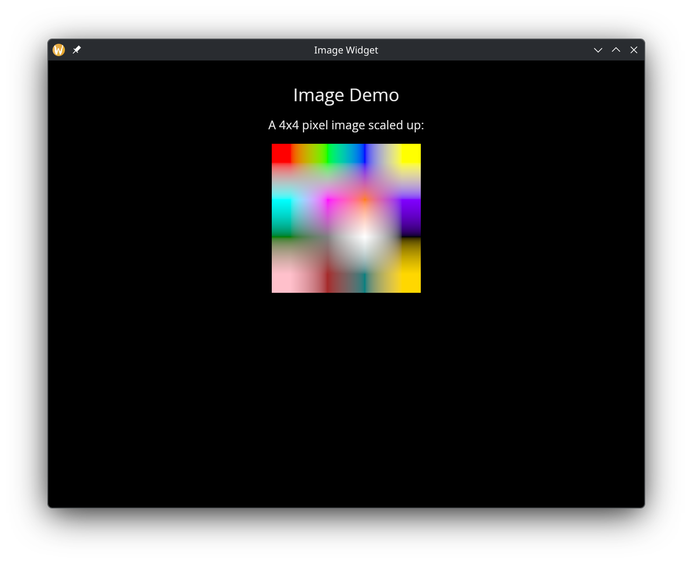
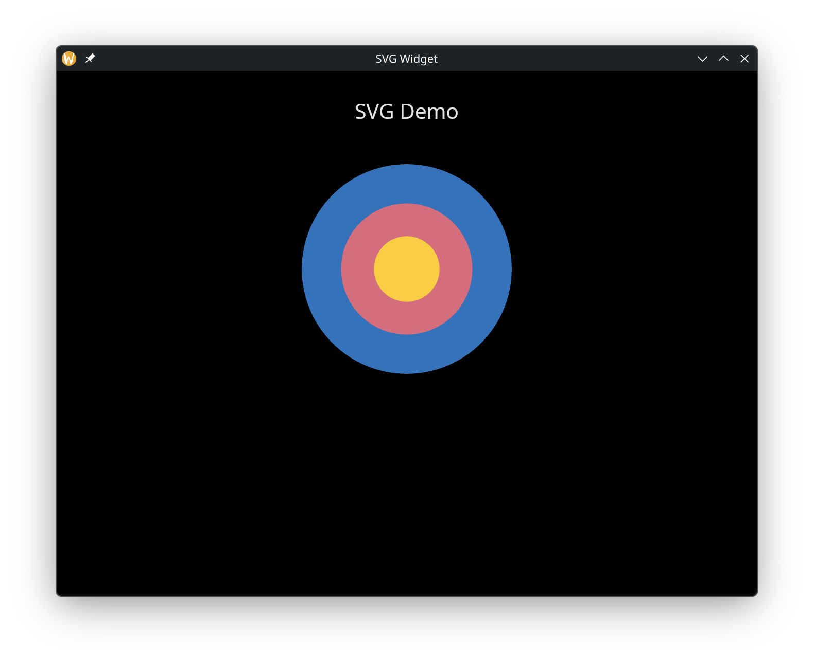

# The Image & SVG Widgets

The `image` widget displays raster images from files, raw bytes, or pixel buffers. The `svg` widget renders Scalable Vector Graphics from files or inline XML. Both support sizing and content fitting controls.

## Interface

### image

```graphix
type ImageSource = [
  string,
  `Bytes(bytes),
  `Rgba({width: u32, height: u32, pixels: bytes})
];

val image: fn(
  ?#width: &Length,
  ?#height: &Length,
  ?#content_fit: &ContentFit,
  &ImageSource
) -> Widget
```

### svg

```graphix
val svg: fn(
  ?#width: &Length,
  ?#height: &Length,
  ?#content_fit: &ContentFit,
  &string
) -> Widget
```

## Parameters

Both widgets share the same labeled arguments:

- **width** - Horizontal sizing as a `Length`. Defaults to `` `Shrink ``.
- **height** - Vertical sizing as a `Length`. Defaults to `` `Shrink ``.
- **content_fit** - Controls how the content is scaled to fill the available space:
  - `` `Fill `` -- Stretch to fill the entire area, ignoring aspect ratio.
  - `` `Contain `` -- Scale uniformly to fit within the area, preserving aspect ratio. May leave empty space.
  - `` `Cover `` -- Scale uniformly to cover the entire area, preserving aspect ratio. May crop content.
  - `` `None `` -- Display at the original size with no scaling.
  - `` `ScaleDown `` -- Like `` `Contain `` but only scales down, never up.

## Image Sources

The `image` widget accepts an `ImageSource` union with three variants:

- **string** -- A file path to a PNG, JPEG, BMP, GIF, or other supported image format. The path is relative to the working directory.
- **`` `Bytes(bytes) ``** -- Raw image file bytes (e.g. the contents of a PNG file loaded with `fs::read`). Useful when image data comes from a network source or is embedded in the program. Bytes literals use the `bytes:<base64>` syntax.
- **`` `Rgba({width, height, pixels}) ``** -- A raw RGBA pixel buffer. The `width` and `height` fields specify the image dimensions, and `pixels` is a `bytes` value containing `width * height * 4` bytes (one byte each for red, green, blue, and alpha per pixel, in row-major order).

The `svg` widget accepts a string that is either a file path to an `.svg` file or inline SVG XML content.

## Examples

### Image

```graphix
{{#include ../../examples/gui/image.gx}}
```



### SVG

```graphix
{{#include ../../examples/gui/svg.gx}}
```



## See Also

- [canvas](canvas.md) - Programmatic 2D drawing
- [types](types.md) - ContentFit and other shared type definitions
