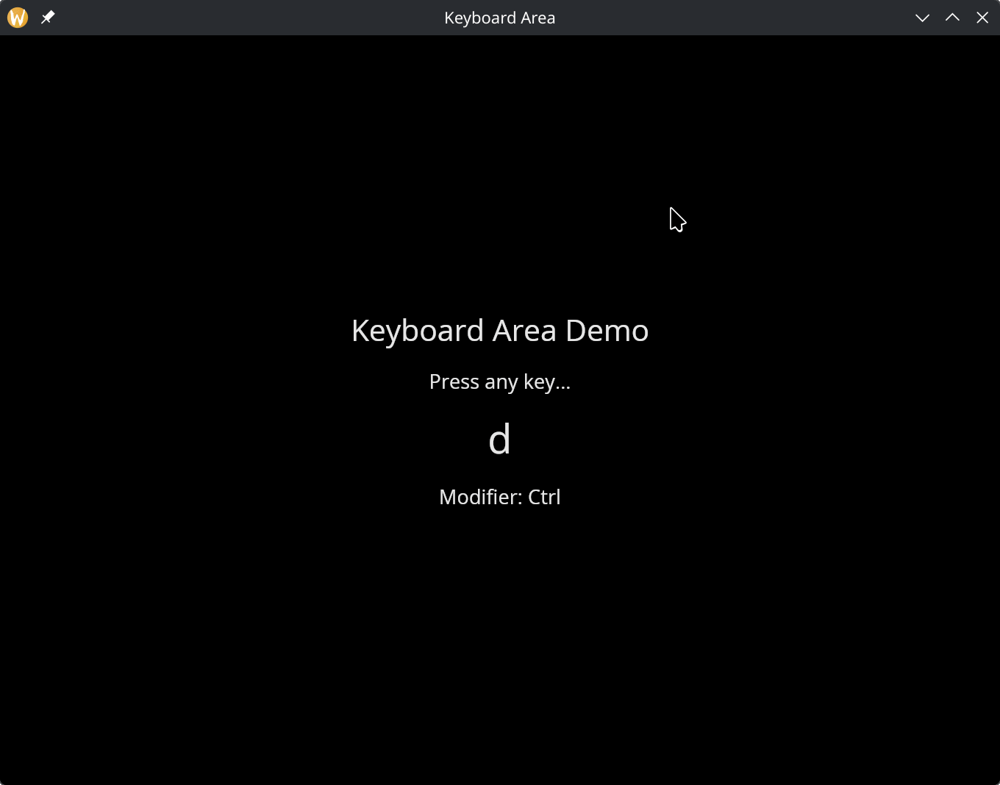

# The Keyboard Area Widget

The `keyboard_area` widget wraps a child and captures keyboard events. Use it to build keyboard-driven interactions like shortcuts, navigation, or text handling.

## Interface

```graphix
type KeyEvent = {
  key: string,
  modifiers: { shift: bool, ctrl: bool, alt: bool, logo: bool },
  text: string,
  repeat: bool
};

val keyboard_area: fn(
  ?#on_key_press: fn(KeyEvent) -> Any,
  ?#on_key_release: fn(KeyEvent) -> Any,
  &Widget
) -> Widget
```

## The KeyEvent Type

- **key** — the key name (e.g. `"a"`, `"Enter"`, `"ArrowUp"`)
- **modifiers** — which modifier keys were held: `shift`, `ctrl`, `alt`, `logo` (super/command)
- **text** — the text produced by the key press (empty for non-character keys)
- **repeat** — `true` if this is an auto-repeat event from holding the key

## Parameters

- **on_key_press** — called with a `KeyEvent` when a key is pressed
- **on_key_release** — called with a `KeyEvent` when a key is released

The positional argument is a reference to the child widget.

## Examples

```graphix
{{#include ../../examples/gui/keyboard_area.gx}}
```



## See Also

- [Mouse Area](mouse_area.md) — mouse event capture
- [Text Input](text_input.md) — built-in text input handling
