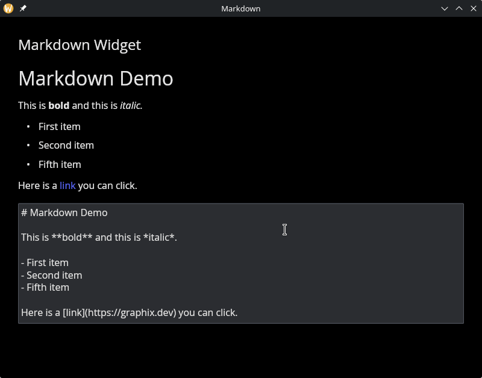

# The Markdown Widget

Renders a markdown string as rich text with support for headings, bold, italic, lists, code blocks, and clickable links.

## Interface

```graphix
val markdown: fn(
  ?#on_link: fn(string) -> Any,
  ?#spacing: &[f64, null],
  ?#text_size: &[f64, null],
  ?#width: &Length,
  &string
) -> Widget
```

## Parameters

- **`#on_link`** -- Callback invoked when the user clicks a link in the rendered markdown. Receives the URL as a `string`. If omitted, links are displayed but not interactive.
- **`#spacing`** -- Vertical space in pixels between markdown elements (paragraphs, headings, lists), or `null` for the default spacing.
- **`#text_size`** -- Base text size in pixels, or `null` for the default. Headings scale relative to this size.
- **`#width`** -- Width of the markdown content area. Accepts `Length` values. Defaults to `` `Fill ``.
- **positional `&string`** -- The markdown source text to render.

## Examples

### Rendered Markdown with Link Callback

```graphix
{{#include ../../examples/gui/markdown.gx}}
```



## See Also

- [text](text.md) -- for plain text display
- [text_editor](text_editor.md) -- for editing text content
