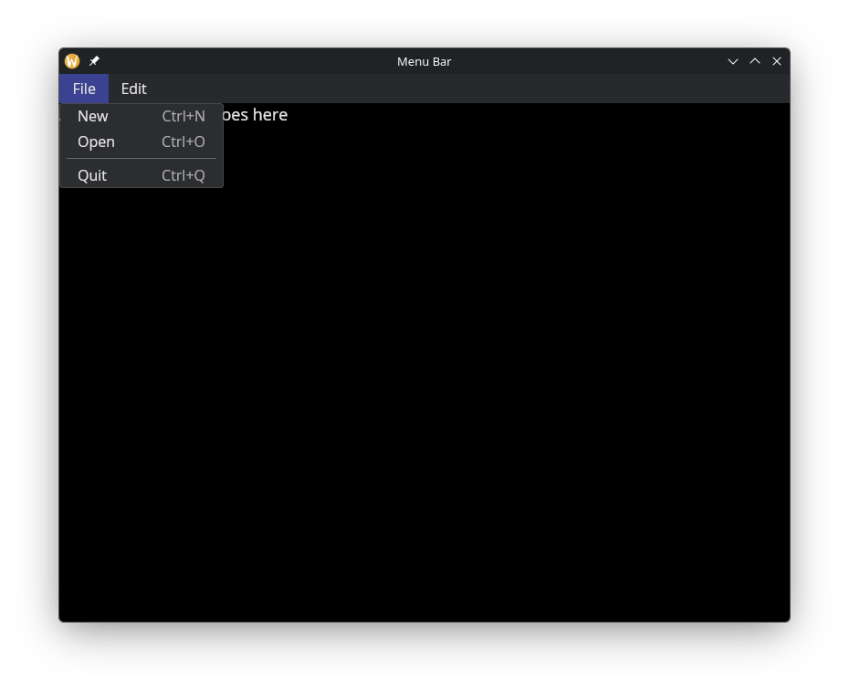
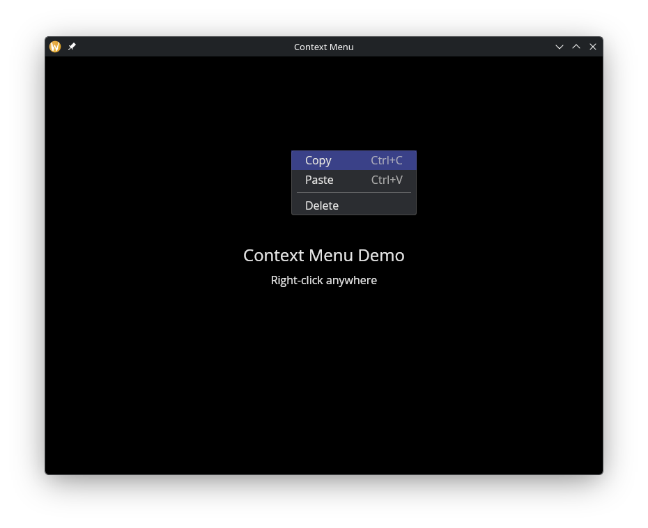

# Menus

The `menu` module provides menu bars and context menus. Both are built from the same `MenuItem` building blocks — actions (clickable items with optional keyboard shortcuts) and dividers.

## Interface

```graphix
type Shortcut;

val shortcut: fn(
  ?#ctrl: bool,
  ?#shift: bool,
  ?#alt: bool,
  ?#logo: bool,
  string
) -> [Shortcut, Error<`InvalidKey(string)>];

type MenuAction = {
  label: &string,
  shortcut: &[Shortcut, null],
  on_click: &fn(null) -> Any,
  disabled: &bool
};

type MenuItem = [`Action(MenuAction), `Divider];

type MenuGroup = {
  label: &string,
  items: &Array<MenuItem>
};

type ContextMenu = { child: &Widget, items: &Array<MenuItem> };

val action: fn(
  ?#on_click: fn(null) -> Any,
  ?#shortcut: &[Shortcut, null],
  ?#disabled: &bool,
  &string
) -> MenuItem;

val divider: fn() -> MenuItem;

val menu: fn(&string, &Array<MenuItem>) -> MenuGroup;

val bar: fn(?#width: &Length, &Array<MenuGroup>) -> Widget;

val context_menu: fn(&Array<MenuItem>, &Widget) -> Widget
```

## `menu::shortcut`

Creates a keyboard shortcut from modifier flags and a single character key.

- **`#ctrl`** -- Hold Ctrl. Defaults to `false`.
- **`#shift`** -- Hold Shift. Defaults to `false`.
- **`#alt`** -- Hold Alt. Defaults to `false`.
- **`#logo`** -- Hold the logo/super key. Defaults to `false`.
- **positional `string`** -- A single character (e.g. `"N"`, `"Z"`). Returns an error if the key is not exactly one character.

The shortcut text (e.g. "Ctrl+N") is displayed right-aligned in dimmed text next to the menu item label. Pressing the key combination triggers the action globally within the window.

## `menu::action` Parameters

- **`#on_click`** -- Callback invoked when the action is clicked. Receives `null`. If omitted, the action is displayed but does nothing.
- **`#shortcut`** -- A `Shortcut` value created by `menu::shortcut(...)`. The shortcut text is shown right-aligned in the menu and the key combination triggers the action. `null` for no shortcut.
- **`#disabled`** -- When `true`, the action is grayed out and `#on_click` is not triggered. Defaults to `false`.
- **positional `&string`** -- The label text for this menu action.

## `menu::divider`

Takes no arguments. Returns a horizontal separator line between menu items.

## `menu::menu`

Groups a list of menu items under a label that appears in the menu bar.

- **positional `&string`** -- The label shown in the menu bar (e.g. `"File"`, `"Edit"`).
- **positional `&Array<MenuItem>`** -- The items in this dropdown menu.

## `menu::bar` Parameters

- **`#width`** -- Width of the menu bar. Accepts `Length` values. Defaults to `` `Shrink ``.
- **positional `&Array<MenuGroup>`** -- The menu groups to display in the bar.

## `menu::context_menu`

Wraps any widget and shows a dropdown menu on right-click. Reuses the same `MenuItem` type as the menu bar.

- **positional `&Array<MenuItem>`** -- The items to display in the context menu.
- **positional `&Widget`** -- The child widget. Right-clicking anywhere on this widget opens the menu at the cursor position.

The menu closes when an item is clicked, when the user clicks outside it, or when Escape is pressed.

## Examples

### Menu Bar

```graphix
{{#include ../../examples/gui/menu_bar.gx}}
```



### Context Menu

```graphix
{{#include ../../examples/gui/context_menu.gx}}
```



## See Also

- [button](button.md) -- for standalone clickable actions
- [keyboard_area](keyboard_area.md) -- for capturing keyboard shortcuts
- [mouse_area](mouse_area.md) -- for general mouse event handling
