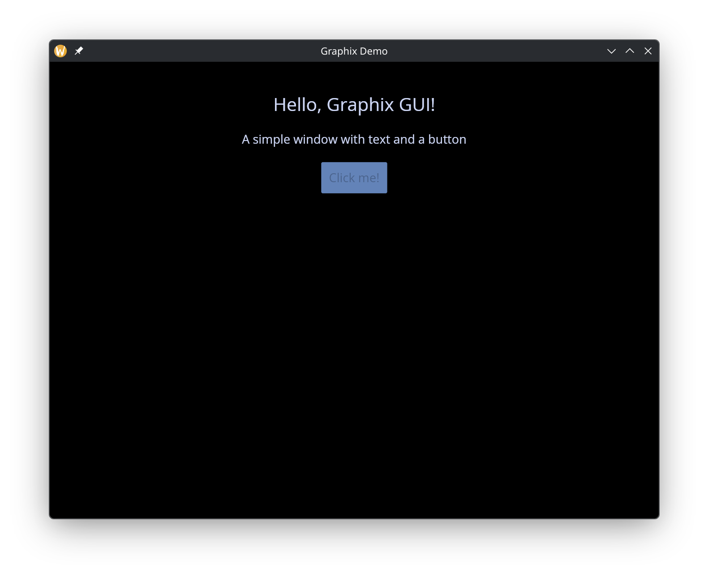
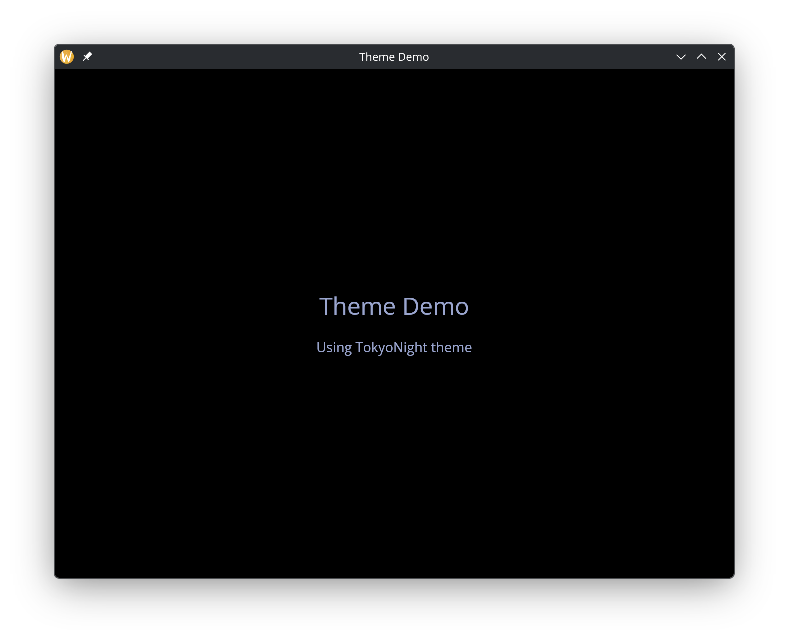

# Graphical User Interfaces (GUIs)

Graphix includes a GUI library built on the Rust [iced](https://iced.rs) framework. It provides native desktop windowing with GPU-accelerated rendering via wgpu, giving you high-performance graphical applications with the same reactive programming model used throughout Graphix.

## What the GUI Library Offers

- **Native windowing**: Real desktop windows managed by the OS, not terminal emulation
- **GPU-accelerated rendering**: All drawing goes through wgpu for smooth, high-performance output
- **Reactive widgets**: A rich set of interactive widgets (buttons, text inputs, sliders, etc.) that update automatically when their data changes
- **Multi-window support**: Programs can create and manage multiple windows simultaneously
- **Theming**: 22 built-in themes plus fully custom palettes and per-widget style overrides
- **Auto-detection**: The Graphix shell detects GUI mode automatically when the program's last expression has type `Gui` -- no special flags needed

## The Window Type

Every GUI program is built around windows. The `Window` type describes a window and its content:

```graphix
type Window = { title: &string, size: &Size, theme: &Theme, content: &Widget };
type Gui = Array<&Window>;

val window: fn(
  ?#title: &string,
  ?#size: &Size,
  ?#theme: &Theme,
  &Widget
) -> Window;
```

All parameters except the content widget are optional. Defaults are `"Graphix"` for the title, `{ width: 800.0, height: 600.0 }` for the size, and `` `Dark `` for the theme.

The final expression of your program should be an `Array<&Window>` -- the shell sees this type and launches the GUI runtime.

## Getting Started

Here is a minimal GUI program that creates a window with text and a button:

```graphix
{{#include ../../examples/gui/hello.gx}}
```



A few things to notice:

- `use gui` brings the top-level GUI module into scope, which gives access to `window` and shared types like `Length`, `Padding`, and `Theme`.
- Individual widget modules (`gui::text`, `gui::column`, `gui::button`) are imported separately.
- Widget arguments are passed as references with `&`. Even literal values like `&20.0` and `&"Hello, Graphix GUI!"` are wrapped in `&`.
- The program's final value is a one-element array `[&window(...)]`, which has type `Gui`.

## The Reference Pattern

GUI widgets take `&` references so that updates propagate with fine granularity. When you write:

```graphix
let name = "world"
text(&"Hello, [name]!")
```

The `text` widget holds a reference to the string expression `"Hello, [name]!"`. When `name` changes, only this specific text widget re-renders -- the rest of the window is untouched.

This is especially important for interactive widgets. A text input, for example, takes a `&string` for its current value and provides a callback to update it:

```graphix
let name = ""
text_input(#on_input: |v| name <- v, #placeholder: &"Type here...", &name)
```

The `<-` connect operator schedules `name` to update on the next cycle, and because the text input holds a reference to `name`, it automatically reflects the new value.

## Theming

Every window accepts a `#theme` parameter that controls its visual appearance. Graphix ships with 22 built-in themes plus support for fully custom palettes and stylesheets:

```graphix
{{#include ../../examples/gui/themes.gx}}
```



See the [theming](theming.md) page for the full list of built-in themes, custom palette creation, and per-widget style overrides.

## Further Reading

- [Types](types.md) -- reference for all shared types (`Widget`, `Length`, `Padding`, `Color`, `Font`, etc.)
- [Theming](theming.md) -- built-in themes, custom palettes, and per-widget stylesheets
