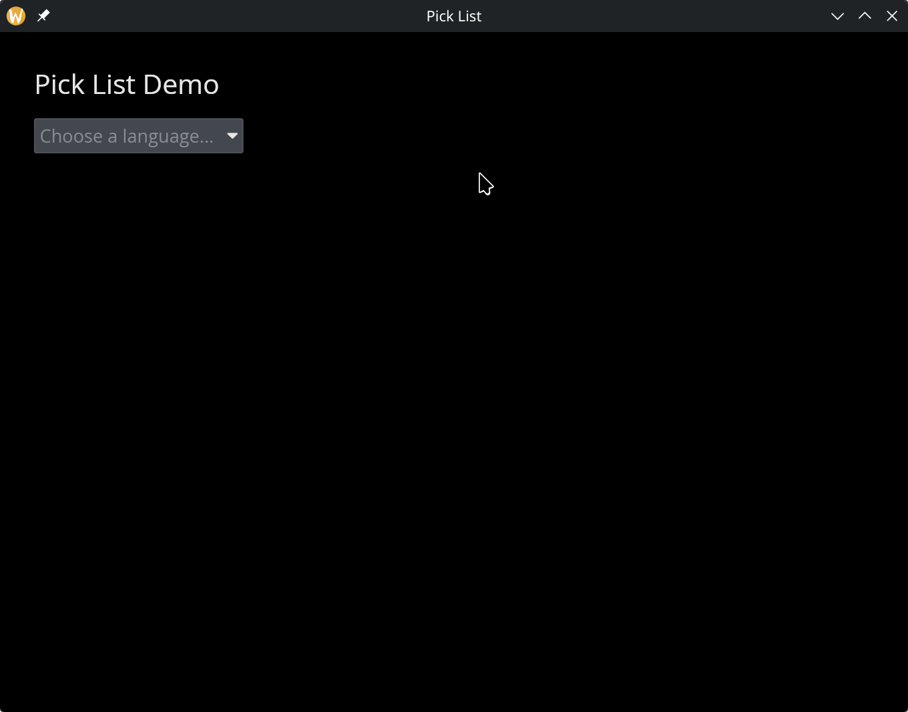

# The Pick List Widget

A dropdown menu that lets the user select one option from a list of strings. Clicking the widget opens a dropdown; selecting an item closes it and triggers the callback.

## Interface

```graphix
val pick_list: fn(
  ?#selected: &[string, null],
  ?#on_select: fn(string) -> Any,
  ?#placeholder: &string,
  ?#width: &Length,
  ?#padding: &Padding,
  ?#disabled: &bool,
  &Array<string>
) -> Widget
```

## Parameters

- **`#selected`** -- Reference to the currently selected value, or `null` if nothing is selected. When `null`, the placeholder text is shown instead.
- **`#on_select`** -- Callback invoked when the user picks an item. Receives the selected string. Typically: `#on_select: |v| choice <- v`.
- **`#placeholder`** -- Text displayed when `#selected` is `null`. Gives the user a hint about what to choose.
- **`#width`** -- Width of the dropdown. Accepts `Length` values.
- **`#padding`** -- Interior padding around the displayed text. Accepts `Padding` values.
- **`#disabled`** -- When `true`, the dropdown cannot be opened. Defaults to `false`.
- **positional `&Array<string>`** -- Reference to the list of available options.

## Examples

```graphix
{{#include ../../examples/gui/pick_list.gx}}
```



## See Also

- [Combo Box](combo_box.md) — searchable dropdown with type-to-filter
- [Radio](radio.md) — inline single-select when there are few options
