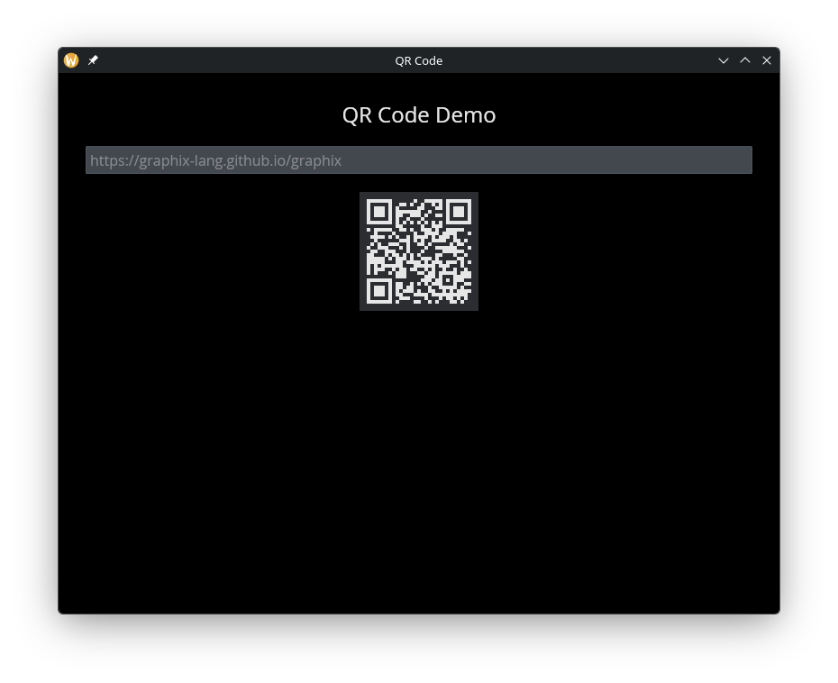

# The QR Code Widget

Encodes a string as a QR code image. The QR code updates reactively when the input string changes.

## Interface

```graphix
val qr_code: fn(
  ?#cell_size: &[f64, null],
  &string
) -> Widget
```

## Parameters

- **`#cell_size`** -- Size in pixels of each cell in the QR code matrix, or `null` for the default size. Larger values produce a bigger QR code image.
- **positional `&string`** -- The data to encode. Any valid string will be encoded into the QR code.

## Examples

### QR Code from Text Input

```graphix
{{#include ../../examples/gui/qr_code.gx}}
```



## See Also

- [text](text.md) -- for displaying text alongside a QR code
- [image](image.md) -- for displaying raster images
