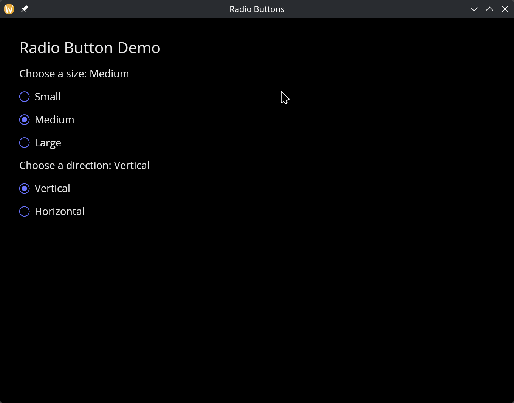

# The Radio Widget

A radio button for single-select choices within a group. Each `radio` widget represents one option. When the currently selected value matches this radio's value, the button is filled. Clicking an unselected radio triggers the `#on_select` callback.

## Interface

```graphix
val radio: fn(
  #label: &string,
  ?#selected: &'a,
  ?#on_select: fn('a) -> Any,
  ?#width: &Length,
  ?#size: &[f64, null],
  ?#spacing: &[f64, null],
  ?#disabled: &bool,
  &'a
) -> Widget
```

## Parameters

- **`#label`** (required) -- Text displayed next to the radio button. Unlike most labeled arguments in GUI widgets, this one is **not optional** -- every radio button must have a label.
- **`#selected`** -- Reference to the currently selected value. When this value equals the positional value, the radio button appears filled. Pass the same reference to every radio in the group so they stay in sync.
- **`#on_select`** -- Callback invoked when this radio is clicked. Receives this radio's value (the positional argument). Typically: `#on_select: |v| selection <- v`.
- **`#width`** -- Width of the widget (radio button plus label). Accepts `Length` values.
- **`#size`** -- Size of the radio circle in pixels, or `null` for the default size.
- **`#spacing`** -- Gap in pixels between the radio circle and the label text, or `null` for the default spacing.
- **`#disabled`** -- When `true`, the radio button is grayed out and cannot be selected. Defaults to `false`.
- **positional `&Any`** -- The value this radio button represents. When the user clicks this radio, `#on_select` receives this value. The radio appears selected when `#selected` equals this value.

## Examples

### Radio Group

```graphix
{{#include ../../examples/gui/radio.gx}}
```



Note: the `selected` variable is typed as `Any` so it can hold any value used for comparison. In the example above, string values are used as the radio values.

## See Also

- [checkbox](checkbox.md) -- for multi-select boolean toggles
- [toggler](toggler.md) -- for on/off switches
- [pick_list](pick_list.md) -- for dropdown-based selection
