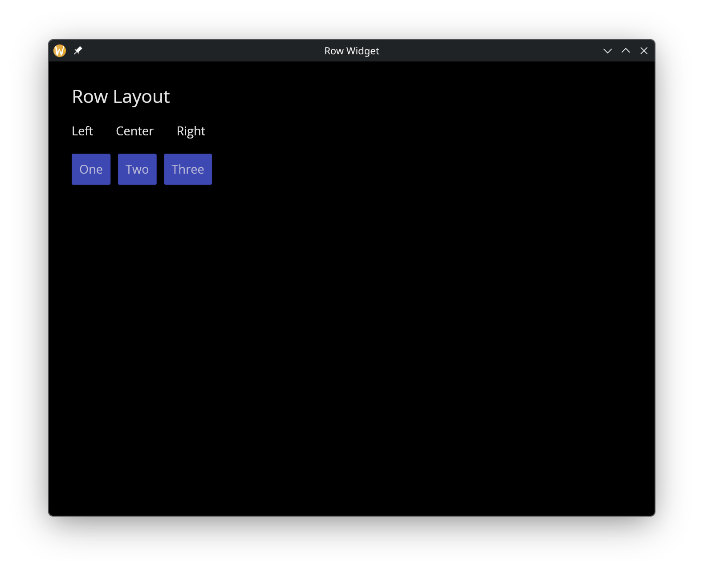

# The Row Widget

The `row` widget arranges child widgets horizontally from left to right. It is one of the primary layout containers, along with `column`.

## Interface

```graphix
val row: fn(
  ?#spacing: &f64,
  ?#padding: &Padding,
  ?#width: &Length,
  ?#height: &Length,
  ?#valign: &VAlign,
  &Array<Widget>
) -> Widget
```

## Parameters

- **spacing** — horizontal space between child widgets in pixels
- **padding** — space around the row's edges
- **width** — row width (`Fill`, `Shrink`, `Fixed(px)`, or `FillPortion(n)`)
- **height** — row height
- **valign** — vertical alignment of children within the row (`Top`, `Center`, `Bottom`)

The positional argument is a reference to an array of child widgets.

## Examples

```graphix
{{#include ../../examples/gui/row.gx}}
```



## See Also

- [Column](column.md) — vertical layout
- [Container](container.md) — single-child alignment and padding
- [Space & Rules](space.md) — spacing and dividers within layouts
