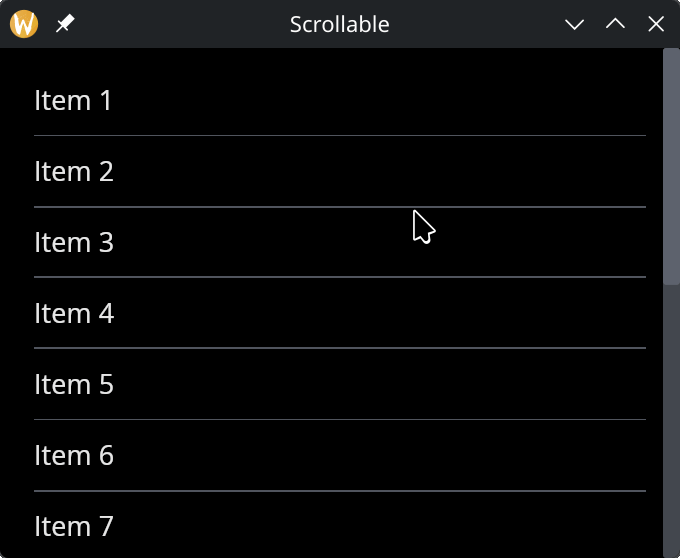

# The Scrollable Widget

The `scrollable` widget wraps content that may exceed the available space, providing scroll bars to navigate. It supports vertical, horizontal, or bidirectional scrolling.

## Interface

```graphix
val scrollable: fn(
  ?#direction: &ScrollDirection,
  ?#on_scroll: fn({x: f64, y: f64}) -> Any,
  ?#width: &Length,
  ?#height: &Length,
  &Widget
) -> Widget
```

## Parameters

- **direction** — scroll direction: `Vertical` (default), `Horizontal`, or `Both`
- **on_scroll** — callback receiving the scroll offset as `{x, y}` when the user scrolls
- **width** — widget width
- **height** — widget height

The positional argument is a reference to the child widget to scroll.

## Examples

```graphix
{{#include ../../examples/gui/scrollable.gx}}
```



## See Also

- [Column](column.md) — commonly used inside scrollable for vertical lists
- [Space & Rules](space.md) — dividers between scrollable items
