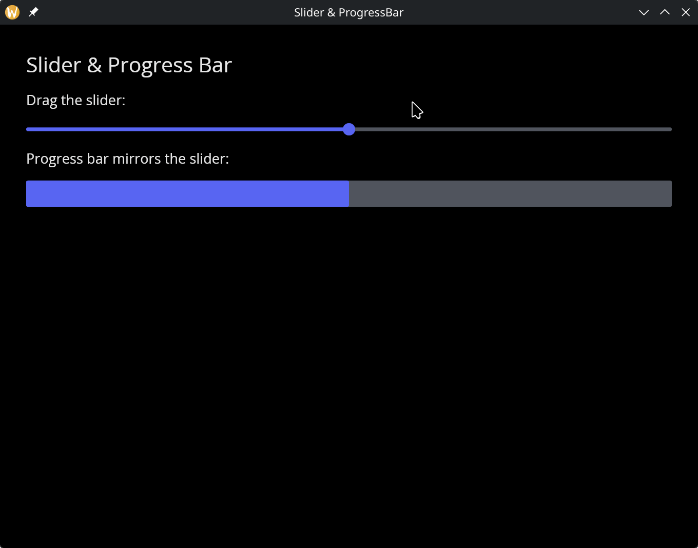
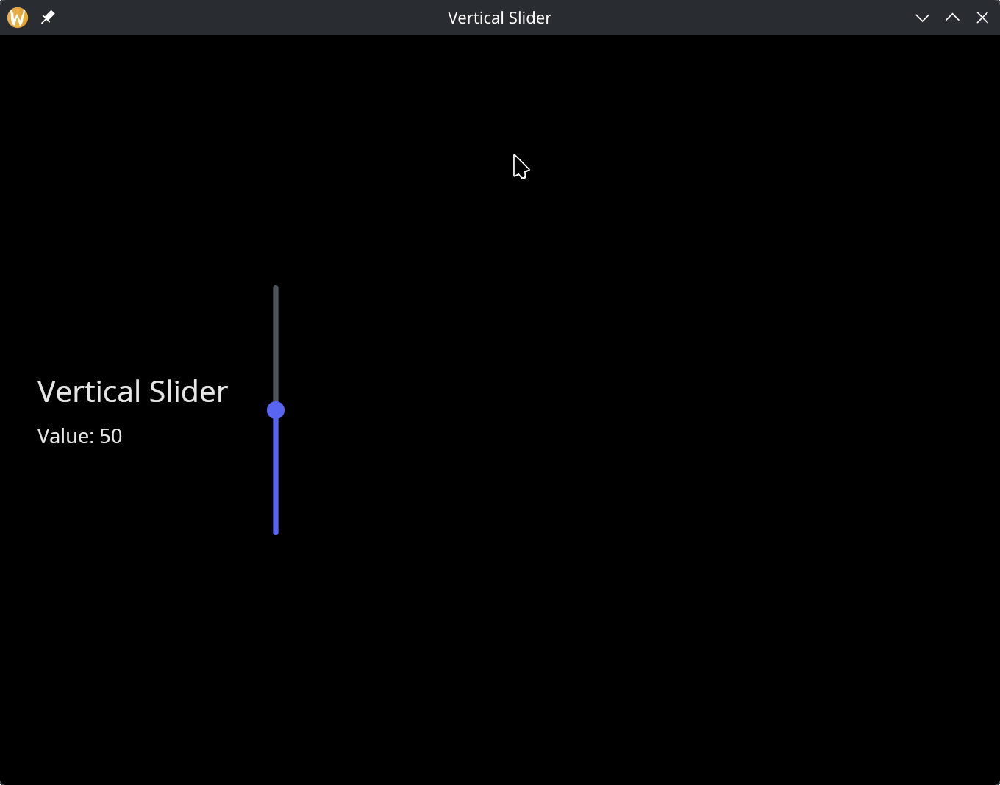

# The Slider Widgets

Graphix provides three related widgets for numeric values within a range: `slider` (horizontal), `vertical_slider`, and `progress_bar` (display-only).

## Slider

A horizontal slider that lets the user select a floating-point value by dragging a handle along a track.

### Interface

```graphix
val slider: fn(
  ?#min: &f64,
  ?#max: &f64,
  ?#step: &[f64, null],
  ?#on_change: fn(f64) -> Any,
  ?#on_release: fn(null) -> Any,
  ?#width: &Length,
  ?#height: &[f64, null],
  ?#disabled: &bool,
  &f64
) -> Widget
```

### Parameters

- **`#min`** -- Minimum value of the range. Defaults to `0.0`.
- **`#max`** -- Maximum value of the range. Defaults to `100.0`.
- **`#step`** -- Snap increment. When set, the slider snaps to multiples of this value. `null` means continuous (no snapping).
- **`#on_change`** -- Callback invoked as the handle is dragged. Receives the current `f64` value. Typically: `#on_change: |v| volume <- v`.
- **`#on_release`** -- Callback invoked when the user releases the handle. Receives `null`. Useful for committing a value only after the user finishes adjusting.
- **`#width`** -- Width of the slider track. Accepts `Length` values. Defaults to `` `Fill ``.
- **`#height`** -- Height of the slider track in pixels, or `null` for the default height.
- **`#disabled`** -- When `true`, the slider cannot be dragged. Defaults to `false`.
- **positional `&f64`** -- Reference to the current value. Must be within the `#min`..`#max` range.

## Vertical Slider

A vertical slider -- identical to `slider` but oriented top-to-bottom. Note the width and height types are swapped: `#width` is `&[f64, null]` (fixed pixels) and `#height` is `&Length` (layout-based).

### Interface

```graphix
val vertical_slider: fn(
  ?#min: &f64,
  ?#max: &f64,
  ?#step: &[f64, null],
  ?#on_change: fn(f64) -> Any,
  ?#on_release: fn(null) -> Any,
  ?#width: &[f64, null],
  ?#height: &Length,
  ?#disabled: &bool,
  &f64
) -> Widget
```

### Parameters

Same as `slider` except:

- **`#width`** -- Width of the slider track in pixels, or `null` for the default width. This is `&[f64, null]`, not `&Length`.
- **`#height`** -- Height of the slider track. Accepts `Length` values (`` `Fill ``, `` `Shrink ``, `` `Fixed(f64) ``). This is `&Length`, not `&[f64, null]`.

## Progress Bar

A non-interactive horizontal bar that fills proportionally to a value within a range. Use it to display progress, levels, or any metric that the user should see but not control.

### Interface

```graphix
val progress_bar: fn(
  ?#min: &f64,
  ?#max: &f64,
  ?#width: &Length,
  ?#height: &[f64, null],
  &f64
) -> Widget
```

### Parameters

- **`#min`** -- Minimum value of the range. Defaults to `0.0`.
- **`#max`** -- Maximum value of the range. Defaults to `100.0`.
- **`#width`** -- Width of the bar. Accepts `Length` values. Defaults to `` `Fill ``.
- **`#height`** -- Height of the bar in pixels, or `null` for the default height.
- **positional `&f64`** -- Reference to the current value. The bar fills proportionally between `#min` and `#max`.

## Examples

### Slider & Progress Bar

```graphix
{{#include ../../examples/gui/slider.gx}}
```



### Vertical Slider

```graphix
{{#include ../../examples/gui/vertical_slider.gx}}
```



## See Also

- [text_input](text_input.md) -- for entering numeric values as text
- [types](types.md) -- for `Length` and other shared types
