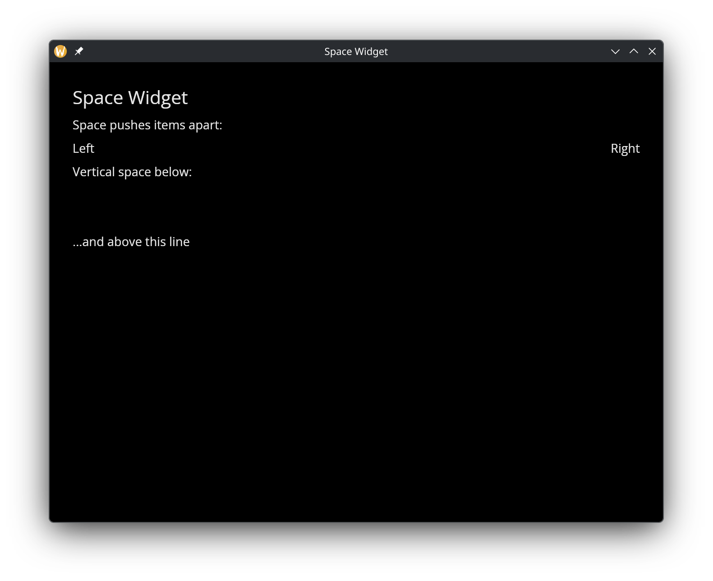
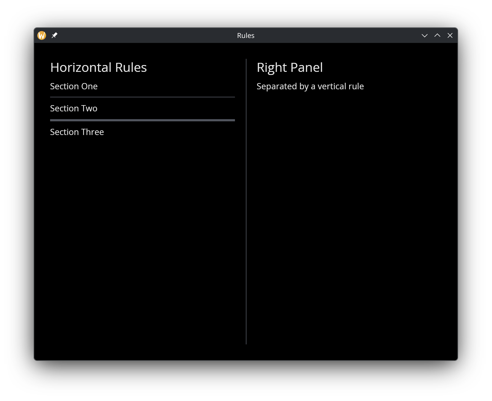

# Space & Rules

Space and rules are layout utilities for controlling whitespace and adding visual dividers between widgets.

## Space

The `space` widget creates empty space with configurable dimensions. Use it to push widgets apart within a row or column.

### Interface

```graphix
val space: fn(
  ?#width: &Length,
  ?#height: &Length
) -> Widget
```

### Parameters

- **width** — horizontal size of the space
- **height** — vertical size of the space

A common pattern is `space(#width: &`Fill)` to push items to opposite ends of a row.

### Example

```graphix
{{#include ../../examples/gui/space.gx}}
```



## Rules

Rules draw horizontal or vertical lines to visually separate content.

### Interface

```graphix
val horizontal_rule: fn(?#height: &f64) -> Widget;
val vertical_rule: fn(?#width: &f64) -> Widget;
```

### Parameters

- **height** (horizontal_rule) — thickness of the horizontal line in pixels
- **width** (vertical_rule) — thickness of the vertical line in pixels

### Example

```graphix
{{#include ../../examples/gui/rule.gx}}
```



## See Also

- [Column](column.md) — vertical layout where rules serve as dividers
- [Row](row.md) — horizontal layout where vertical rules separate sections
- [Scrollable](scrollable.md) — rules work well between scrollable list items
