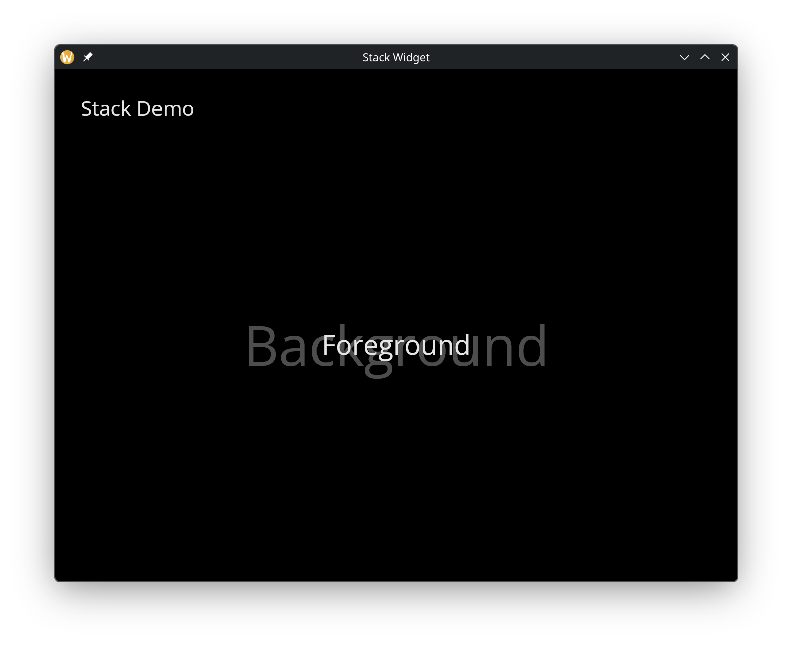

# The Stack Widget

The `stack` widget layers children on top of each other. The first child is drawn at the bottom, and each subsequent child is drawn on top. This is useful for overlays, watermarks, or layered visual effects.

## Interface

```graphix
val stack: fn(
  ?#width: &Length,
  ?#height: &Length,
  &Array<Widget>
) -> Widget
```

## Parameters

- **width** — stack width
- **height** — stack height

The positional argument is a reference to an array of child widgets. Children are drawn in order, with later children appearing on top of earlier ones.

## Examples

```graphix
{{#include ../../examples/gui/stack.gx}}
```



## See Also

- [Container](container.md) — for positioning content within stack layers
- [Column](column.md) — for non-overlapping vertical layout
