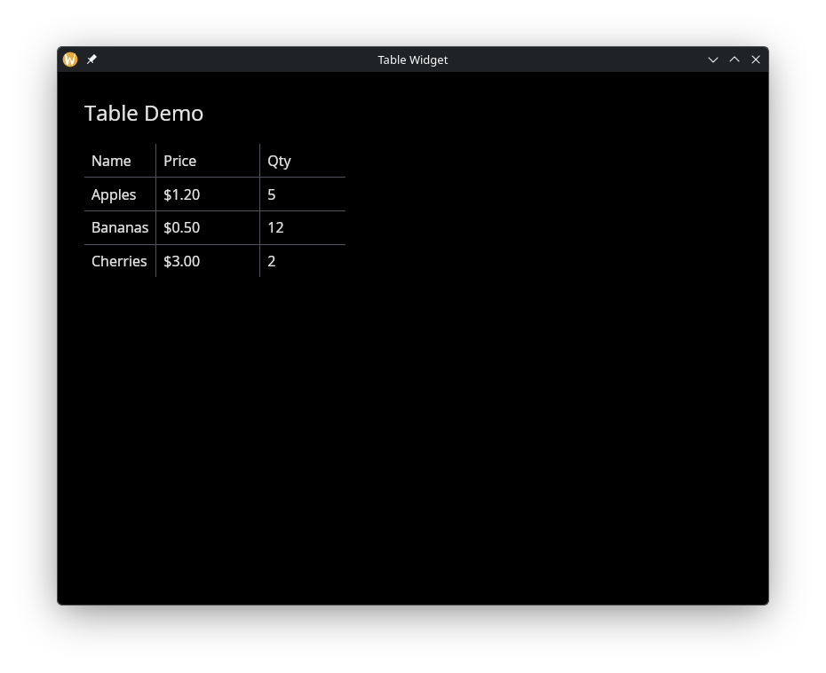

# The Table Widget

Displays data in rows and columns with configurable headers, alignment, and separators. Tables are built from `TableColumn` definitions and a 2D array of row widgets.

## Interface

```graphix
type TableColumn = {
  header: &Widget,
  width: &Length,
  halign: &HAlign,
  valign: &VAlign
};

val table_column: fn(
  ?#width: &Length,
  ?#halign: &HAlign,
  ?#valign: &VAlign,
  &Widget
) -> TableColumn;

val table: fn(
  ?#width: &Length,
  ?#padding: &[f64, null],
  ?#separator: &[f64, null],
  &Array<TableColumn>,
  &Array<Array<Widget>>
) -> Widget
```

## `table_column` Parameters

- **`#width`** -- Width of this column. Accepts `Length` values: `` `Fill ``, `` `Shrink ``, or `` `Fixed(f64) ``. Defaults to `` `Shrink ``.
- **`#halign`** -- Horizontal alignment of content within this column: `` `Left ``, `` `Center ``, or `` `Right ``. Defaults to `` `Left ``.
- **`#valign`** -- Vertical alignment of content within this column: `` `Top ``, `` `Center ``, or `` `Bottom ``. Defaults to `` `Top ``.
- **positional `&Widget`** -- The header widget for this column, typically a styled `text` widget.

## `table` Parameters

- **`#width`** -- Total width of the table. Accepts `Length` values. Defaults to `` `Shrink ``.
- **`#padding`** -- Padding in pixels around each cell, or `null` for no padding.
- **`#separator`** -- Thickness in pixels of the line between rows, or `null` for no separators.
- **positional `&Array<TableColumn>`** -- Column definitions created with `table_column`.
- **positional `&Array<Array<Widget>>`** -- Row data. Each inner array has one widget per column.

## Examples

### Product Table

```graphix
{{#include ../../examples/gui/table.gx}}
```



## See Also

- [column](column.md) -- for simple vertical layouts
- [grid](grid.md) -- for uniform grid layouts
- [types](types.md) -- for `Length`, `HAlign`, `VAlign`
