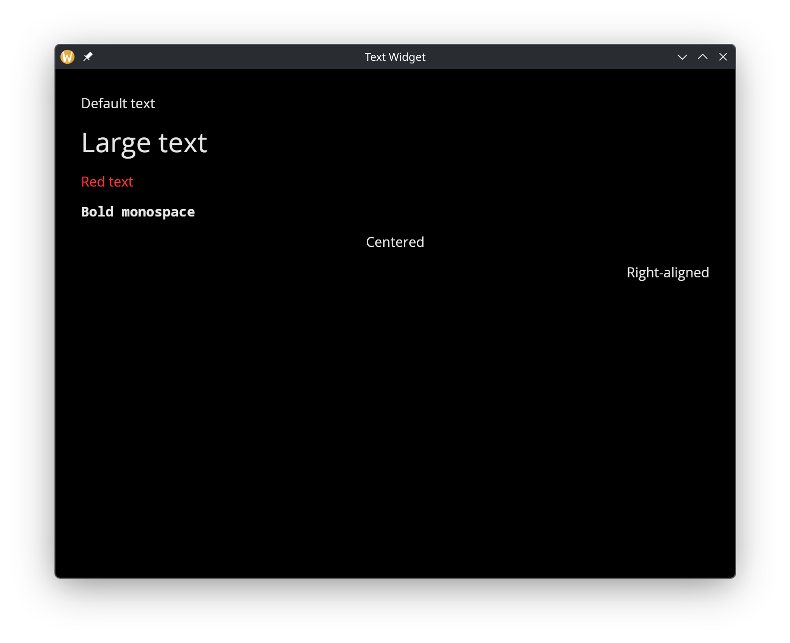

# The Text Widget

The `text` widget displays a string with optional styling. It is the most basic display widget and the foundation for showing any textual content in a GUI application. Font size, color, font family, weight, style, sizing, and alignment are all configurable through labeled arguments.

## Interface

```graphix
val text: fn(
  ?#size: &[f64, null],
  ?#color: &[Color, null],
  ?#font: &[Font, null],
  ?#width: &Length,
  ?#height: &Length,
  ?#halign: &HAlign,
  ?#valign: &VAlign,
  &string
) -> Widget
```

## Parameters

- **size** - Font size in pixels. Defaults to the theme's standard text size when null.
- **color** - Text color as a `Color` struct with `r`, `g`, `b`, `a` fields, each a float from 0.0 to 1.0. Defaults to the theme's text color when null.
- **font** - A `Font` struct controlling the typeface:
  - `family`: One of `` `SansSerif ``, `` `Serif ``, `` `Monospace ``, or `` `Name(string) `` for a specific font name.
  - `weight`: One of `` `Thin ``, `` `ExtraLight ``, `` `Light ``, `` `Normal ``, `` `Medium ``, `` `SemiBold ``, `` `Bold ``, `` `ExtraBold ``, `` `Black ``.
  - `style`: One of `` `Normal ``, `` `Italic ``, `` `Oblique ``.
- **width** - Horizontal sizing as a `Length`: `` `Fill ``, `` `Shrink ``, `` `Fixed(f64) ``, or `` `FillPortion(i64) ``. Defaults to `` `Shrink ``.
- **height** - Vertical sizing as a `Length`. Defaults to `` `Shrink ``.
- **halign** - Horizontal text alignment: `` `Left ``, `` `Center ``, or `` `Right ``. Defaults to `` `Left ``. Only visible when the widget is wider than the text (e.g. with `#width: &`Fill``).
- **valign** - Vertical text alignment: `` `Top ``, `` `Center ``, or `` `Bottom ``. Defaults to `` `Top ``.

The positional argument is a reference to the string to display. Because it is a reference, the text updates reactively when the underlying value changes.

## Examples

### Styling and Alignment

```graphix
{{#include ../../examples/gui/text.gx}}
```



## See Also

- [button](button.md) - Clickable button that wraps a widget (often text)
- [text_input](text_input.md) - Editable single-line text field
- [text_editor](text_editor.md) - Multi-line text editing
