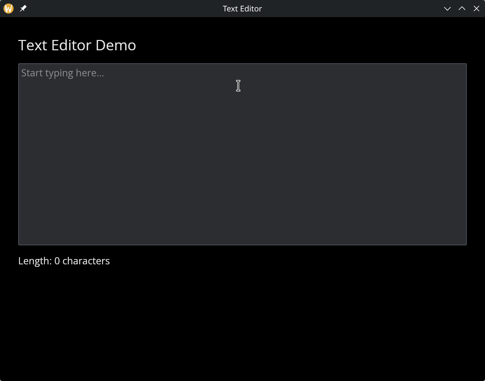

# The Text Editor Widget

A multi-line text editing area for longer-form content. Unlike `text_input`, which handles a single line, `text_editor` supports multiple lines of text with scrolling. It reports the full content string on every edit.

## Interface

```graphix
val text_editor: fn(
  ?#placeholder: &string,
  ?#on_edit: fn(string) -> Any,
  ?#width: &[f64, null],
  ?#height: &[f64, null],
  ?#padding: &Padding,
  ?#font: &[Font, null],
  ?#size: &[f64, null],
  ?#disabled: &bool,
  &string
) -> Widget
```

## Parameters

- **`#placeholder`** -- Hint text displayed when the editor is empty.
- **`#on_edit`** -- Callback invoked on every edit. Receives the full content as a `string`. Use with `<-` to keep state in sync: `#on_edit: |v| content <- v`.
- **`#width`** -- Width in pixels as `f64`, or `null` for automatic sizing. Note: this is `&[f64, null]`, not `&Length` -- the text editor uses fixed pixel dimensions rather than the layout-based `Length` type.
- **`#height`** -- Height in pixels as `f64`, or `null` for automatic sizing. Same `&[f64, null]` type as width.
- **`#padding`** -- Interior padding around the text content. Accepts `Padding` values.
- **`#font`** -- Font to use, or `null` for the default font.
- **`#size`** -- Font size in pixels, or `null` for the default size.
- **`#disabled`** -- When `true`, the editor cannot be focused or edited. Defaults to `false`.
- **positional `&string`** -- Reference to the current content. The editor displays this text and you update it from the `#on_edit` callback.

## Examples

### Basic Text Editor

```graphix
{{#include ../../examples/gui/text_editor.gx}}
```



## See Also

- [text_input](text_input.md) -- single-line text input
- [text](text.md) -- read-only text display
