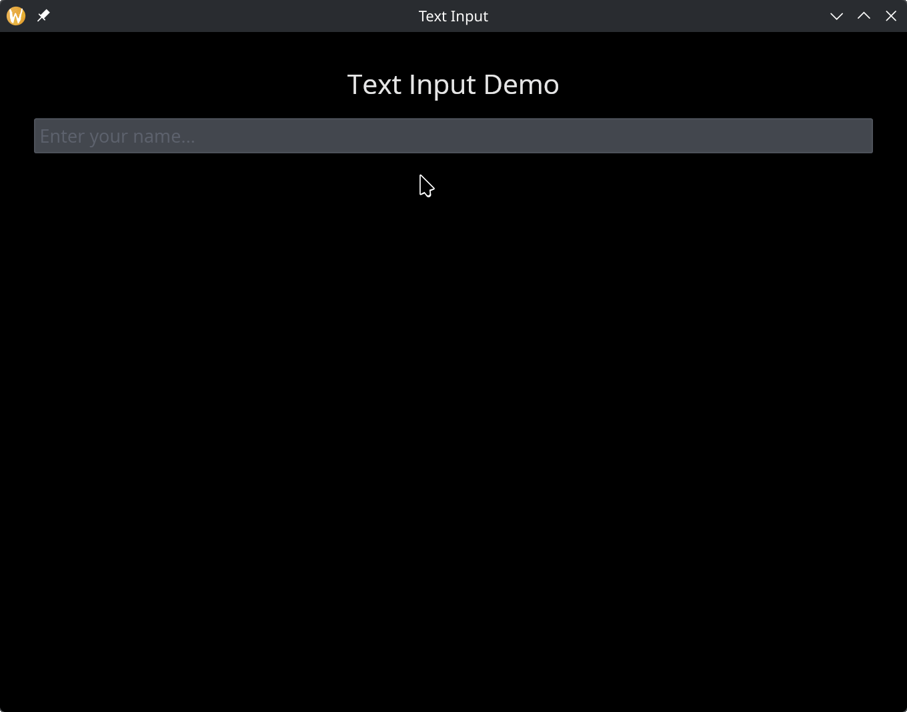

# The Text Input Widget

A single-line text field for user input. The widget displays the current value via a reference and reports changes through callbacks. Supports placeholder text, password masking, and custom sizing.

## Interface

```graphix
val text_input: fn(
  ?#placeholder: &string,
  ?#on_input: fn(string) -> Any,
  ?#on_submit: fn(null) -> Any,
  ?#is_secure: &bool,
  ?#width: &Length,
  ?#padding: &Padding,
  ?#size: &[f64, null],
  ?#font: &[Font, null],
  ?#disabled: &bool,
  &string
) -> Widget
```

## Parameters

- **`#placeholder`** -- Hint text displayed when the field is empty. Shown in a lighter style and disappears once the user begins typing.
- **`#on_input`** -- Callback invoked on every keystroke. Receives the full current text as a `string`. Typically used with `<-` to update state: `#on_input: |v| name <- v`.
- **`#on_submit`** -- Callback invoked when the user presses Enter. Receives `null`. Useful for form submission or triggering a search.
- **`#is_secure`** -- When `true`, the input is masked (password mode). Characters are replaced with dots. Defaults to `false`.
- **`#width`** -- Width of the input field. Accepts `Length` values. Defaults to `` `Fill ``.
- **`#padding`** -- Interior padding around the text content. Accepts `Padding` values.
- **`#size`** -- Font size in pixels, or `null` for the default size.
- **`#font`** -- Font to use for the text, or `null` for the default font.
- **`#disabled`** -- When `true`, the input cannot be focused or edited. Defaults to `false`.
- **positional `&string`** -- Reference to the current text value. The widget reads from this reference to display the text, and you update it from the `#on_input` callback.

## Examples

### Basic Text Input

```graphix
{{#include ../../examples/gui/text_input.gx}}
```



## See Also

- [text_editor](text_editor.md) -- multi-line text editing
- [text](text.md) -- displaying static or reactive text
