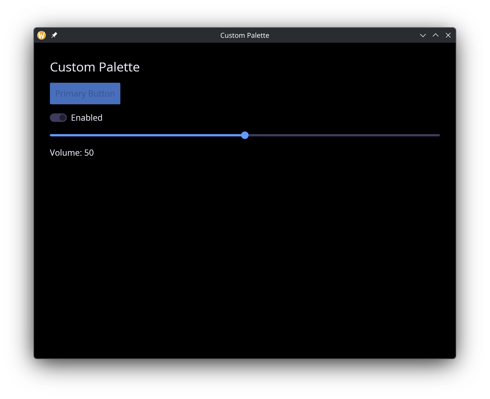
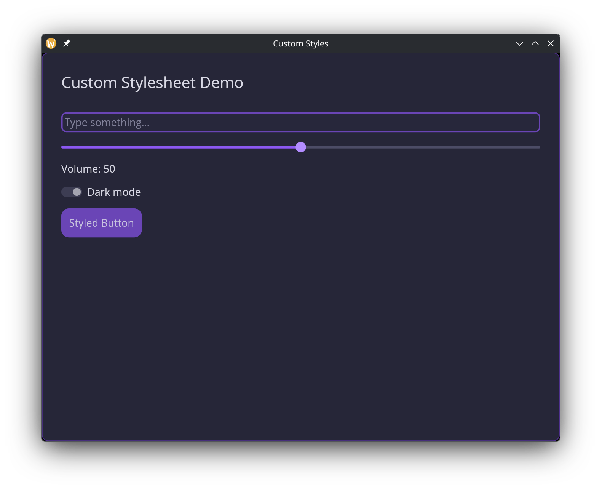

# Theming

Every GUI window accepts a `#theme` parameter that controls the visual appearance of all widgets inside it. Graphix provides 22 built-in themes, plus two mechanisms for full customization: custom palettes and custom stylesheets.

## Built-in Themes

The `Theme` type enumerates all available themes:

```graphix
type Theme = [
  `Light,
  `Dark,
  `Dracula,
  `Nord,
  `SolarizedLight,
  `SolarizedDark,
  `GruvboxLight,
  `GruvboxDark,
  `CatppuccinLatte,
  `CatppuccinFrappe,
  `CatppuccinMacchiato,
  `CatppuccinMocha,
  `TokyoNight,
  `TokyoNightStorm,
  `TokyoNightLight,
  `KanagawaWave,
  `KanagawaDragon,
  `KanagawaLotus,
  `Moonfly,
  `Nightfly,
  `Oxocarbon,
  `Ferra,
  `Custom(StyleSheet),
  `CustomPalette(Palette)
];
```

Apply a theme by passing it to the `window` function:

```graphix
window(#theme: &`CatppuccinMocha, &content)
```

Since `#theme` takes a `&Theme`, you can change the theme reactively:

```graphix
let dark = true
let theme = select dark {
  true => `Dark,
  false => `Light
}

window(#theme: &theme, &content)
```

## Custom Palettes

For quick color customization without defining per-widget styles, use `` `CustomPalette `` with a `Palette`:

```graphix
type Palette = {
  background: Color,
  danger: Color,
  primary: Color,
  success: Color,
  text: Color,
  warning: Color
};
```

The palette defines the core colors from which iced derives all widget styles automatically:

- `background` -- window and container backgrounds.
- `text` -- default text color.
- `primary` -- accent color for buttons, sliders, active elements.
- `success` -- color for success states (e.g., toggler when enabled).
- `danger` -- color for destructive actions and error states.
- `warning` -- color for warning indicators.

```graphix
{{#include ../../examples/gui/custom_palette.gx}}
```



## Custom Stylesheets

For full control over individual widget appearances, use `` `Custom(StyleSheet) ``. A stylesheet combines a palette with optional per-widget style overrides:

```graphix
type StyleSheet = {
  button: [ButtonStyle, null],
  checkbox: [CheckboxStyle, null],
  container: [ContainerStyle, null],
  menu: [MenuStyle, null],
  palette: Palette,
  pick_list: [PickListStyle, null],
  progress_bar: [ProgressBarStyle, null],
  radio: [RadioStyle, null],
  rule: [RuleStyle, null],
  scrollable: [ScrollableStyle, null],
  slider: [SliderStyle, null],
  text_editor: [TextEditorStyle, null],
  text_input: [TextInputStyle, null],
  toggler: [TogglerStyle, null]
};
```

Every widget style field is optional (union with `null`). When `null`, the widget inherits its style from the palette automatically.

### The `stylesheet` Builder

Use the `stylesheet` function to construct a `StyleSheet` without filling in every field manually. Only `#palette` is required; all widget style parameters default to `null`:

```graphix
val stylesheet: fn(
  #palette: Palette,
  ?#button: [ButtonStyle, null],
  ?#checkbox: [CheckboxStyle, null],
  ?#container: [ContainerStyle, null],
  ?#menu: [MenuStyle, null],
  ?#pick_list: [PickListStyle, null],
  ?#progress_bar: [ProgressBarStyle, null],
  ?#radio: [RadioStyle, null],
  ?#rule: [RuleStyle, null],
  ?#scrollable: [ScrollableStyle, null],
  ?#slider: [SliderStyle, null],
  ?#text_editor: [TextEditorStyle, null],
  ?#text_input: [TextInputStyle, null],
  ?#toggler: [TogglerStyle, null]
) -> StyleSheet;
```

Example with a custom palette and button override:

```graphix
{{#include ../../examples/gui/custom_styles.gx}}
```



## Per-Widget Style Types

Each widget style type is a struct where every field is optional (`[T, null]`). A `null` field means "inherit from the theme palette." The GUI module provides both the types and corresponding builder functions.

### ButtonStyle

```graphix
type ButtonStyle = {
  background: [Color, null],
  border_color: [Color, null],
  border_radius: [f64, null],
  border_width: [f64, null],
  text_color: [Color, null]
};

val button_style: fn(
  ?#background: [Color, null],
  ?#border_color: [Color, null],
  ?#border_radius: [f64, null],
  ?#border_width: [f64, null],
  ?#text_color: [Color, null]
) -> ButtonStyle;
```

### TextInputStyle

```graphix
type TextInputStyle = {
  background: [Color, null],
  border_color: [Color, null],
  border_radius: [f64, null],
  border_width: [f64, null],
  icon_color: [Color, null],
  placeholder_color: [Color, null],
  selection_color: [Color, null],
  value_color: [Color, null]
};

val text_input_style: fn(
  ?#background: [Color, null],
  ?#border_color: [Color, null],
  ?#border_radius: [f64, null],
  ?#border_width: [f64, null],
  ?#icon_color: [Color, null],
  ?#placeholder_color: [Color, null],
  ?#selection_color: [Color, null],
  ?#value_color: [Color, null]
) -> TextInputStyle;
```

### SliderStyle

```graphix
type SliderStyle = {
  handle_border_color: [Color, null],
  handle_border_width: [f64, null],
  handle_color: [Color, null],
  handle_radius: [f64, null],
  rail_color: [Color, null],
  rail_fill_color: [Color, null],
  rail_width: [f64, null]
};

val slider_style: fn(
  ?#handle_border_color: [Color, null],
  ?#handle_border_width: [f64, null],
  ?#handle_color: [Color, null],
  ?#handle_radius: [f64, null],
  ?#rail_color: [Color, null],
  ?#rail_fill_color: [Color, null],
  ?#rail_width: [f64, null]
) -> SliderStyle;
```

### Other Widget Styles

The remaining widget style types follow the same pattern -- a struct of optional fields with a corresponding builder function:

| Type | Builder | Key Fields |
|------|---------|------------|
| `CheckboxStyle` | `checkbox_style` | `accent`, `background`, `border_color`, `border_radius`, `border_width`, `icon_color`, `text_color` |
| `ContainerStyle` | `container_style` | `background`, `border_color`, `border_radius`, `border_width`, `text_color` |
| `MenuStyle` | `menu_style` | `background`, `border_color`, `border_radius`, `border_width`, `selected_background`, `selected_text_color`, `text_color` |
| `PickListStyle` | `pick_list_style` | `background`, `border_color`, `border_radius`, `border_width`, `handle_color`, `placeholder_color`, `text_color` |
| `ProgressBarStyle` | `progress_bar_style` | `background`, `bar_color`, `border_radius` |
| `RadioStyle` | `radio_style` | `background`, `border_color`, `border_width`, `dot_color`, `text_color` |
| `RuleStyle` | `rule_style` | `color`, `radius`, `width` |
| `ScrollableStyle` | `scrollable_style` | `background`, `border_color`, `border_radius`, `border_width`, `scroller_color` |
| `TextEditorStyle` | `text_editor_style` | `background`, `border_color`, `border_radius`, `border_width`, `placeholder_color`, `selection_color`, `value_color` |
| `TogglerStyle` | `toggler_style` | `background`, `background_border_color`, `border_radius`, `foreground`, `foreground_border_color`, `text_color` |

All builder functions accept the same labeled arguments as the corresponding struct fields, all optional, all defaulting to `null`.
