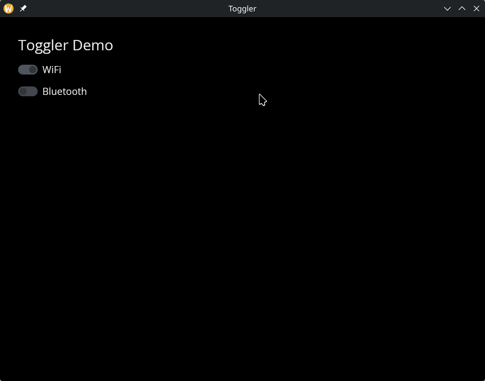

# The Toggler Widget

A toggle switch with an optional text label. Functionally identical to a checkbox but rendered as a sliding toggle, which is often a better visual fit for on/off settings like enabling features or connectivity options.

## Interface

```graphix
val toggler: fn(
  ?#label: &string,
  ?#on_toggle: fn(bool) -> Any,
  ?#width: &Length,
  ?#size: &[f64, null],
  ?#spacing: &[f64, null],
  ?#disabled: &bool,
  &bool
) -> Widget
```

## Parameters

- **`#label`** -- Text displayed next to the toggle switch. If omitted, the toggler renders without a label.
- **`#on_toggle`** -- Callback invoked when the toggle is flipped. Receives the new boolean state. Typically: `#on_toggle: |v| enabled <- v`.
- **`#width`** -- Width of the widget (toggle plus label). Accepts `Length` values.
- **`#size`** -- Size of the toggle switch in pixels, or `null` for the default size.
- **`#spacing`** -- Gap in pixels between the toggle and the label text, or `null` for the default spacing.
- **`#disabled`** -- When `true`, the toggle is grayed out and cannot be flipped. Defaults to `false`.
- **positional `&bool`** -- Reference to the toggled state. `true` renders the toggle in the "on" position, `false` in the "off" position.

## Examples

### Toggle Switches

```graphix
{{#include ../../examples/gui/toggler.gx}}
```



## See Also

- [checkbox](checkbox.md) -- same interface, rendered as a checkbox
- [radio](radio.md) -- for single-select from a group of options
