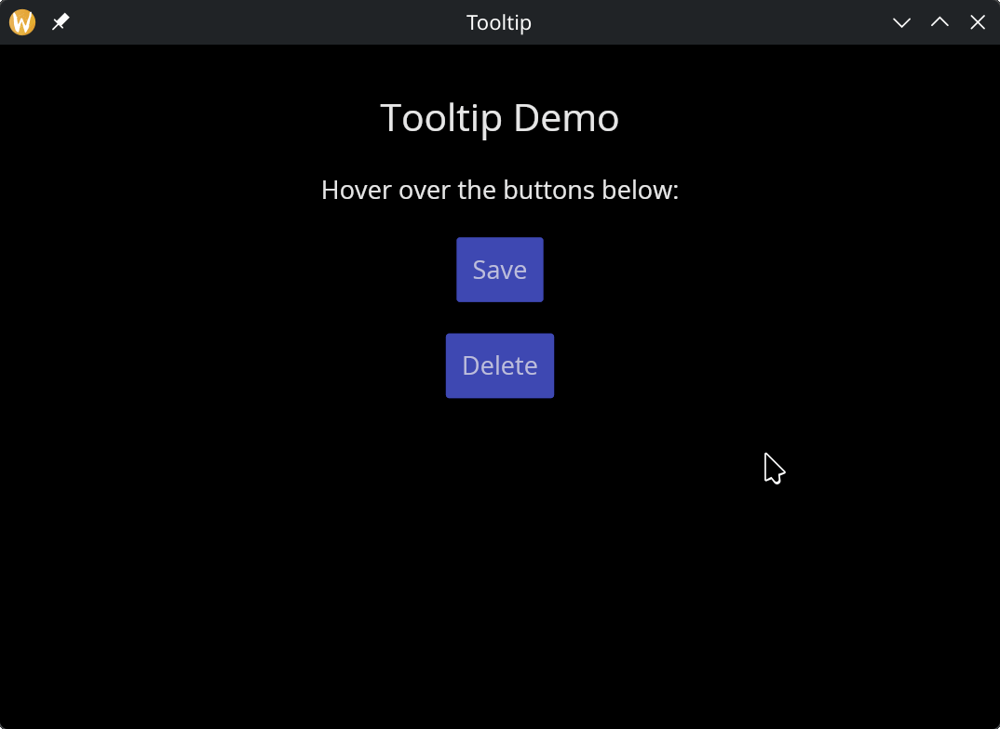

# The Tooltip Widget

The `tooltip` widget displays a popup hint when the user hovers over a child widget. The tooltip content is itself a widget, allowing rich formatted tips.

## Interface

```graphix
val tooltip: fn(
  #tip: &Widget,
  ?#position: &TooltipPosition,
  ?#gap: &[f64, null],
  &Widget
) -> Widget
```

## Parameters

- **tip** — (required) the tooltip content widget, typically `text(...)`. This is a required labeled argument.
- **position** — where the tooltip appears relative to the child: `Top`, `Bottom`, `Left`, `Right`, or `FollowCursor`
- **gap** — space in pixels between the child and the tooltip

The positional argument is a reference to the child widget that triggers the tooltip on hover.

## Examples

```graphix
{{#include ../../examples/gui/tooltip.gx}}
```



## See Also

- [Button](button.md) — commonly wrapped with tooltips
- [Mouse Area](mouse_area.md) — lower-level mouse interaction
